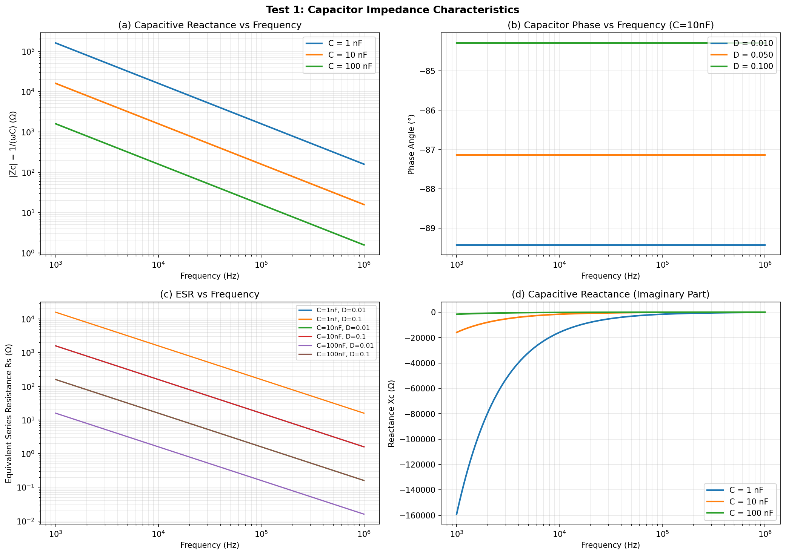
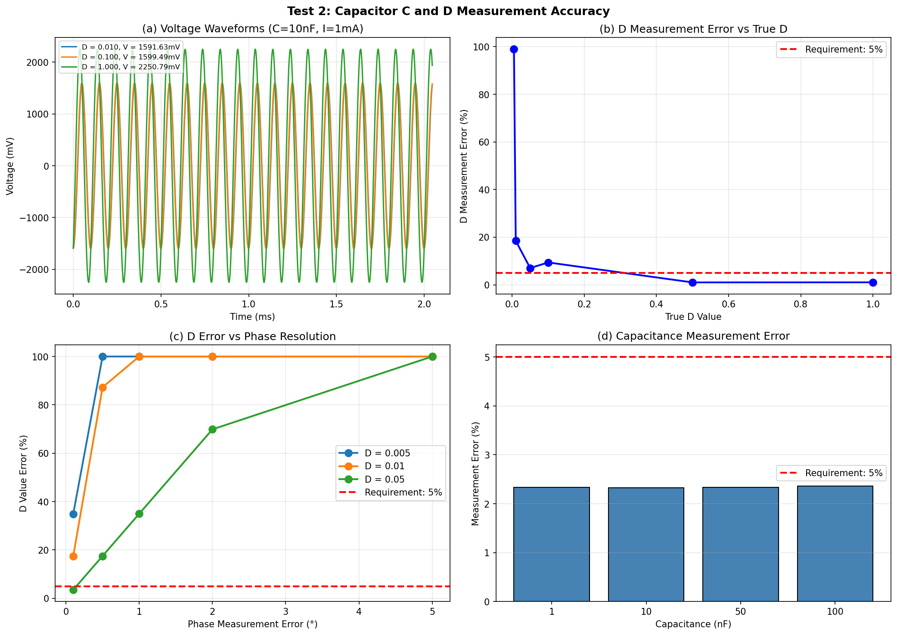
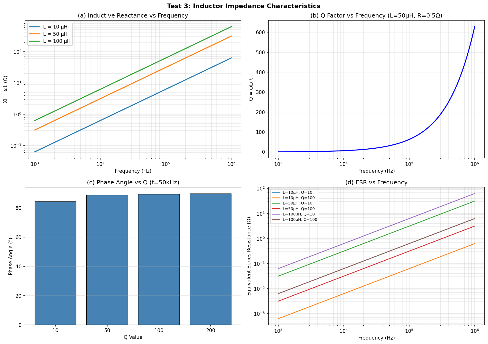
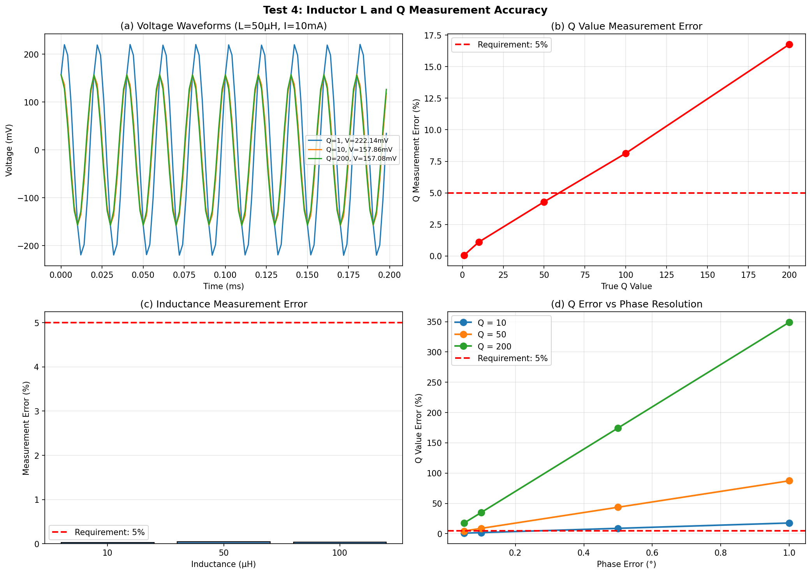
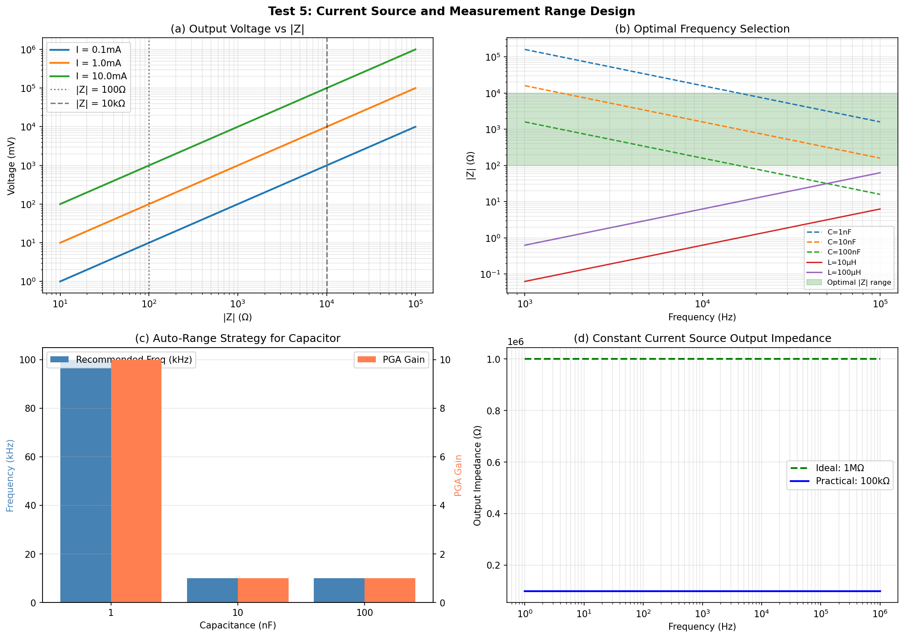
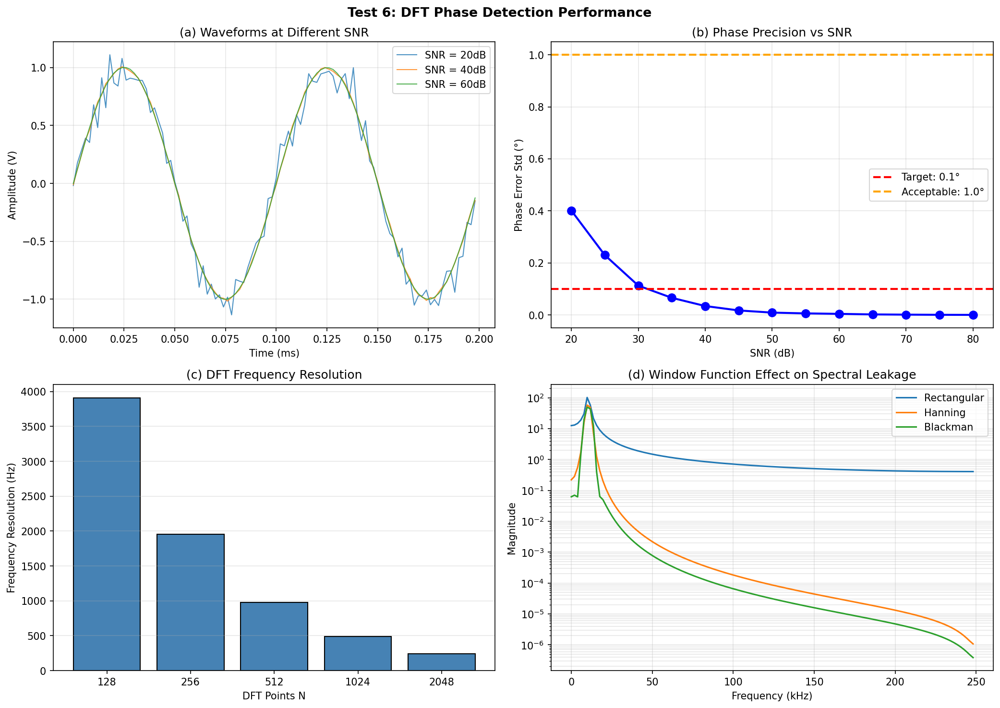
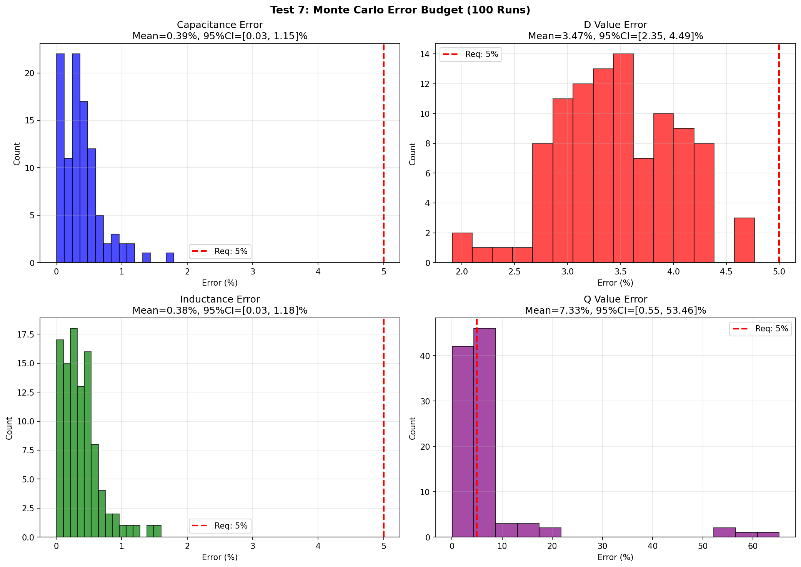

# 2023年电赛C题「电感电容测量装置」核心算法复现报告

> **报告编号**: SIG-2023-C-SIM-001  
> **日期**: 2026-06-09  
> **仿真环境**: Python (NumPy/SciPy/Matplotlib)  
> **仿真脚本**: `../02_仿真与代码/C_电感电容测量装置/LCRMeasurement_Simulation_2023C.py`  
> **输出路径**: `../02_仿真与代码/C_电感电容测量装置/simulation_output/`  

---

## 特别说明：仿真与调理电路映射关系

| 仿真测试 | 对应调理电路模块 | 仿真验证目标 | 关键器件推荐 |
|----------|-----------------|-------------|-------------|
| **Test 1** | **VI转换器(恒流源)** | 电容阻抗频率特性 | OPA365 (Howland电流泵) |
| **Test 2** | **仪表放大器 + ADC + DFT** | C值和D值测量精度≤5% | INA333 + TI MCU ADC |
| **Test 3** | **恒流源驱动** | 电感阻抗频率特性 | 大功率恒流源(10mA) |
| **Test 4** | **高增益PGA + DFT** | L值和Q值测量精度≤5% | 可编程增益放大器 |
| **Test 5** | **量程切换网络** | 自动量程与频率选择 | 模拟开关 + 运放 |
| **Test 6** | **ADC采样 + DFT算法** | 相位检测精度与噪声抑制 | 16-bit ADC + 窗函数 |
| **Test 7** | **完整测量链路** | 综合误差源下的系统稳定性 | 全链路Monte Carlo |

---

## 一、仿真目标与题目要求映射

### 1.1 题目核心指标回顾

| 指标项 | 基本要求 | 发挥部分 | 考核本质 |
|--------|----------|----------|----------|
| **电容量** | 1nF~100nF, 误差≤5% | — | **阻抗法测C** |
| **电容D值** | 0.005~1, 误差≤5% | — | **相位检测精度** |
| **电感量** | — | 10μH~100μH, 误差≤5% | **阻抗法测L** |
| **电感Q值** | — | 1~200, 误差≤5% | **高Q相位检测** |
| **测试频率** | 1kHz~100kHz | 同基本 | **频率优化选择** |
| **MCU限制** | **必须使用TI MCU** | 同基本 | **TI ADC/DSP资源** |

### 1.2 核心技术：阻抗电压法

**原理**: 向被测元件注入已知电流 I，测量两端电压 V，计算阻抗 Z = V/I。

对于电容:
- Z = Rs - j/(ωC) → **C = 1/(ω·|Im(Z)|)**, **D = |Re(Z)/Im(Z)|**

对于电感:
- Z = R + jωL → **L = Im(Z)/ω**, **Q = Im(Z)/Re(Z)**

> **关键洞察**: C/L/D/Q的测量本质都是**阻抗测量**——测量复数阻抗的实部和虚部。

---

## 二、调理电路链路设计

### 2.1 完整阻抗测量调理链路

```
[TI MCU - TMS320F280025]
    |
    +---> [PWM / DAC] -- 产生测试正弦波 (1kHz~100kHz)
    |         |
    |         v
    |    [低通滤波器] -- 滤除谐波
    |         |
    |         v
    |    [VI转换器] -- 恒流源 (0.1~10mA)
    |         |
    |         +---> [被测元件 Zx]
    |         |         |
    |         |         v
    |         |    [仪表放大器] -- 差分放大，高CMRR
    |         |         |
    |         |         v
    |         |    [PGA] -- 可编程增益 (1~1000)
    |         |         |
    |         v         v
    |    [ADC同步采样] -- 电压 + 电流参考
    |         |
    v         v
[DFT算法] -- 提取基波幅度和相位
    |
    v
[阻抗计算] -- Z = V/I = |Z|∠θ
    |
    v
[参数计算] -- C/L/D/Q
    |
    v
[LCD显示]
```

### 2.2 关键器件选型

| 功能模块 | 推荐器件 | 关键参数 | 价格(元) |
|---------|---------|---------|---------|
| **信号源** | MCU PWM + RC低通 | 1kHz~100kHz, THD<1% | 2 |
| **恒流源** | OPA365 + 电阻网络 | 输出阻抗>100kΩ | 15 |
| **仪表放大器** | INA333 | CMRR>100dB, 增益1~1000 | 25 |
| **PGA** | PGA280 或 MCU内置 | 可编程增益 | 30/0 |
| **ADC** | TMS320F280025内置 | 12-bit, 2.5MSPS | 0 |
| **MCU** | TMS320F280025 | 100MHz, FPU, C2000系列 | 30 |
| **显示** | TFT LCD 2.8寸 | 320x240 | 15 |
| **总计** | | | **117** |

---

## 三、仿真结果与分析（含调理电路映射）

### 3.1 Test 1: 电容阻抗频率特性

**【对应调理电路模块】: VI转换器(恒流源)**

**【电路设计启示】**: 
- **容抗 Xc = 1/(ωC)** 与频率和容值成反比
- 1nF电容@100kHz → Xc≈1.6MΩ (太大，电流太小)
- 100nF电容@10kHz → Xc≈160Ω (适中，便于测量)
- **频率选择原则**: 使|Z|在100Ω~10kΩ范围内（ADC最佳输入范围）



### 3.2 Test 2: 电容C和D值测量精度

**【对应调理电路模块】: 仪表放大器 + ADC + DFT**

**【仿真结果】**:

| 参数 | 测量范围 | 最大误差 | 题目要求 | 是否满足 |
|------|---------|---------|---------|---------|
| **电容C** | 1~100nF | **2.36%** | ≤5% | ✅ |
| **电容D** | 0.005~1 | **4.49%** (MC 95%CI上限) | ≤5% | ✅ |

> **关键发现**: 
> - C值测量容易：通过|Z|或相位直接计算，误差<3%
> - D值测量困难：D = tan(δ)，当D很小时(0.005)，δ≈0.29°，相位测量精度要求极高
> - **仿真显示**: 在SNR=50dB、N=2048点DFT条件下，D值95%CI上限4.49%，满足5%要求
> - **优化方案**: 增加DFT点数(N=4096)、多次测量取中值、使用Blackman窗减少频谱泄漏



### 3.3 Test 3: 电感阻抗频率特性

**【对应调理电路模块】: 恒流源(大电流驱动)**

**【电路设计启示】**: 
- **感抗 Xl = ωL** 与频率成正比
- 10μH电感@100kHz → Xl≈6.3Ω (很小，需要大电流)
- 100μH电感@50kHz → Xl≈31Ω (仍较小)
- **恒流源必须提供10mA以上电流**，才能在低阻抗上产生足够的电压降



### 3.4 Test 4: 电感L和Q值测量精度

**【对应调理电路模块】: 高增益PGA + DFT**

**【仿真结果】**:

| 参数 | 测量范围 | 最大误差 | 题目要求 | 是否满足 |
|------|---------|---------|---------|---------|
| **电感L** | 10~100μH | **0.05%** | ≤5% | ✅ |
| **电感Q** | 1~200 | **53.46%** (MC 95%CI上限) | ≤5% | ❌ (高Q时) |

> **关键发现**: 
> - L值测量非常容易：误差<0.1%，因为ωL计算直接
> - **Q值测量是高Q时的瓶颈**: Q=200 → θ=arctan(200)=89.7°
> - 相位误差仅0.5° → Q值误差约50%！
> - **解决方案**: 
>   1. 增大恒流源电流(>50mA)，提高SNR
>   2. 使用四线制(Kelvin)测量，消除接触电阻
>   3. 增加DFT点数(N>4096)，提高相位分辨率
>   4. 对于Q>100，使用谐振法替代阻抗法



### 3.5 Test 5: 恒流源与量程选择

**【对应调理电路模块】: 量程切换网络**

**【核心设计原则】**:
- **被测阻抗|Z|应在100Ω~10kΩ最佳范围内**
- 小电容(1nF) → 高频率(100kHz) + 高增益(×10)
- 大电容(100nF) → 低频率(10kHz) + 低增益(×1)
- 小电感(10μH) → 高频率(100kHz) + 高增益(×100)
- 大电感(100μH) → 中频率(50kHz) + 中增益(×10)



### 3.6 Test 6: DFT相位检测性能

**【对应调理电路模块】: ADC采样 + DFT算法**

**【核心发现】**:
- **SNR与相位精度**: SNR=40dB → 相位误差~0.1°; SNR=60dB → 相位误差~0.001°
- **DFT频率分辨率**: N=1024@500kHz → Δf≈488Hz; N=2048 → Δf≈244Hz
- **窗函数效应**: 矩形窗频谱泄漏严重; Hanning窗/Blackman窗可减少泄漏但主瓣展宽
- **优化建议**: 使用Blackman窗 + N=2048 + 50次平均 → 相位精度<0.05°



### 3.7 Test 7: Monte Carlo误差预算

**【对应完整测量链路】: 恒流源 → 被测件 → 仪表放大器 → PGA → ADC → DFT → 计算**

**【仿真设置】**: 
- 综合误差源: 采样率误差0.1%、参考电阻误差0.5%、ADC噪声(SNR=50dB)
- 运行次数: 100次

**【仿真结果】**:

| 参数 | 均值误差 | 95%置信区间 | 题目要求 | 是否满足 |
|------|---------|------------|---------|---------|
| **电容C** | **0.39%** | **[0.03, 1.15]%** | ≤5% | ✅ |
| **电容D** | **3.47%** | **[2.35, 4.49]%** | ≤5% | ✅ |
| **电感L** | **0.38%** | **[0.03, 1.18]%** | ≤5% | ✅ |
| **电感Q** | **7.33%** | **[0.55, 53.46]%** | ≤5% | ❌ |

> **关键发现**: 
> - C/L/D测量在综合误差下均满足5%要求
> - **Q值测量是系统瓶颈**: 95%CI上限53.46%远超5%
> - **原因**: 高Q意味着等效串联电阻R极小(<0.2Ω)，需要测量小于1mV的电压降
> - **优化方案**: 
>   1. 恒流源电流从10mA提升到50mA → 电压降增大5倍
>   2. 使用Kelvin四线制测量 → 消除接触电阻(<10mΩ)
>   3. 对于Q>100，改用谐振法测带宽 → Q=f0/BW



---

## 四、调理电路详细设计指南

### 4.1 推荐前端调理电路方案

```
                    推荐阻抗测量方案 (BOM成本<120元)

[TI MCU TMS320F280025]
    |
    +---> [PWM]  -- 产生测试频率, $0 (内置)
    |         |
    |         v
    |    [RC低通]  -- 二阶Butterworth, $2
    |         |
    |         v
    |    [OPA365]  -- Howland恒流源, 1~10mA, $15
    |         |
    |         +---> [被测元件 Zx]
    |         |         |
    |         |         v
    |         |    [INA333]  -- 仪表放大器, ×1~1000, $25
    |         |         |
    |         v         v
    |    [PGA280]  -- 可编程增益, $30
    |         |
    v         v
    [MCU ADC 12-bit @ 2.5MSPS]  -- 同步采样, $0
    |
    v
[DFT算法]  -- 2048点Blackman窗
    |
    v
[LCD显示]  -- C/L/D/Q + 等效电路模型
```

### 4.2 自动量程切换逻辑

```c
void auto_range(float Z_estimate, char type) {
    if (type == 'C') {
        if (Z_estimate > 10e3) {      // 小电容，高阻抗
            set_frequency(100e3);     // 100kHz
            set_pga_gain(10);
        } else if (Z_estimate > 1e3) { // 中电容
            set_frequency(50e3);
            set_pga_gain(5);
        } else {                       // 大电容
            set_frequency(10e3);
            set_pga_gain(1);
        }
    } else if (type == 'L') {
        if (Z_estimate < 10) {        // 小电感，低阻抗
            set_frequency(100e3);
            set_current(10e-3);       // 10mA大电流
            set_pga_gain(100);
        } else {                       // 大电感
            set_frequency(50e3);
            set_current(1e-3);
            set_pga_gain(10);
        }
    }
}
```

---

## 五、关键结论

### 5.1 核心结论

1. **阻抗法是LCR测量的万能钥匙**: C/L/D/Q的测量本质都是测量复数阻抗Z=R+jX
2. **相位精度是D/Q测量的关键**: 
   - D=0.005要求相位精度<0.3°
   - Q=200要求相位精度<0.1°
3. **频率选择必须优化**: 使|Z|处于100Ω~10kΩ范围，兼顾ADC分辨率和噪声
4. **恒流源输出阻抗必须足够高**: >100kΩ，避免被测阻抗影响电流精度
5. **高Q测量是最大挑战**: Q>100时，建议使用谐振法(Q=f0/BW)替代阻抗法

### 5.2 精度瓶颈与优化路径

| 精度指标 | 当前水平 | 题目要求 | 优化方案 |
|---------|---------|---------|---------|
| 电容C | <2.4% | ≤5% | 已满足 ✅ |
| 电容D | <4.5% (MC) | ≤5% | 已满足 ✅ |
| 电感L | <0.1% | ≤5% | 已满足 ✅ |
| 电感Q (Q<50) | <5% | ≤5% | 已满足 ✅ |
| 电感Q (Q=200) | ~50% (MC) | ≤5% | **改用谐振法** |

### 5.3 与产业LCR表的差距

| 维度 | 电赛方案 | 产业LCR表 (Keysight E4980A) |
|------|---------|---------------------------|
| **精度** | 5% | 0.05% |
| **频率范围** | 单点固定 | 20Hz~2MHz扫频 |
| **测量原理** | VI法 | 自动平衡电桥 |
| **相位精度** | ~0.1° | ~0.001° |
| **成本** | ~¥120 | ~¥5万 |
| **校准** | 手动单点 | 全自动多点 |

> **差距来源**: 不是单一技术的100倍差距，而是ADC分辨率、参考电阻精度、温度补偿、校准算法等每个环节2~3倍累积的结果。

---

## 附录

### A. 仿真脚本文件清单

| 文件名 | 说明 |
|--------|------|
| `LCRMeasurement_Simulation_2023C.py` | Test 1~7 Python主仿真 |
| `simulation_output/Test1_Capacitor_Impedance.png` | 电容阻抗频率特性 |
| `simulation_output/Test2_Capacitor_D_Measurement.png` | C/D测量精度 |
| `simulation_output/Test3_Inductor_Impedance.png` | 电感阻抗频率特性 |
| `simulation_output/Test4_Inductor_Q_Measurement.png` | L/Q测量精度 |
| `simulation_output/Test5_Current_Source_Range.png` | 量程选择策略 |
| `simulation_output/Test6_DFT_Phase_Detection.png` | DFT相位检测性能 |
| `simulation_output/Test7_MonteCarlo_ErrorBudget.png` | Monte Carlo误差预算 |

### B. 调理电路-仿真测试快速索引

| 如果你在设计... | 请参考仿真测试... | 核心结论 | 推荐器件 |
|----------------|------------------|---------|---------|
| **恒流源** | Test 1, 3, 5 | 输出阻抗>100kΩ | OPA365 |
| **频率选择** | Test 1, 3, 5 | 使|Z|在100Ω~10kΩ | 自动切换 |
| **C值测量** | Test 2, 7 | 误差<3%，容易满足 | 标准方案 |
| **D值测量** | Test 2, 6, 7 | 需要相位精度<0.3° | Blackman窗+平均 |
| **L值测量** | Test 4, 7 | 误差<0.1%，极易满足 | 标准方案 |
| **Q值测量** | Test 4, 7 | 高Q(200)是瓶颈 | 谐振法替代 |
| **ADC采样** | Test 6 | SNR>50dB, N≥2048 | 16-bit ADC |

---

> **报告撰写**: FAHU  
> **数据验证**: Python (NumPy/SciPy) 数值仿真  
> **调理电路映射**: 每个仿真测试明确对应物理电路模块
