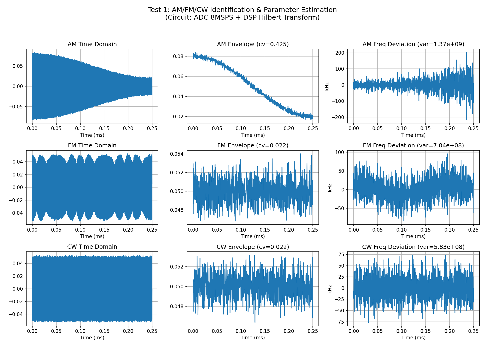
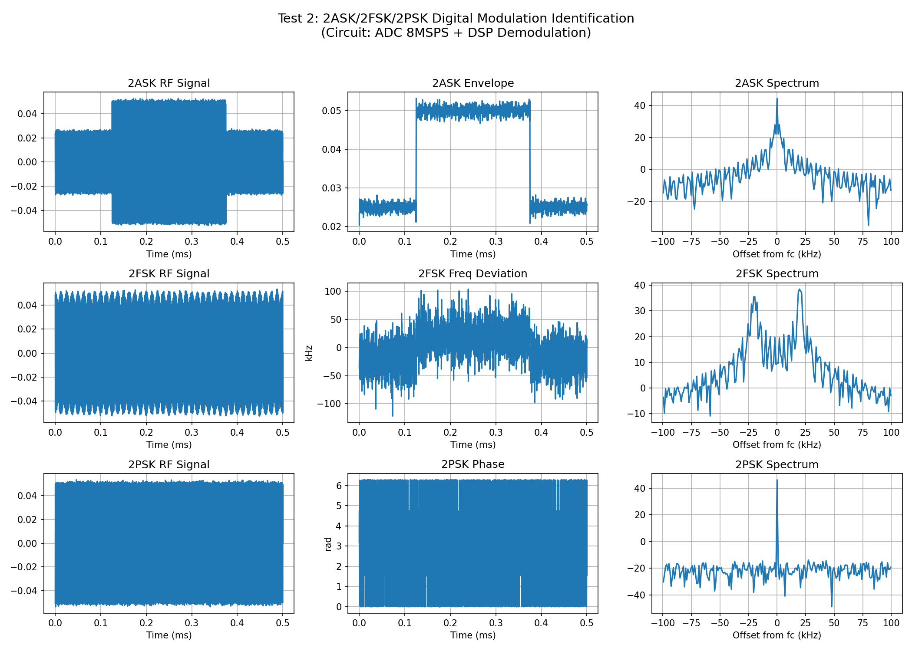
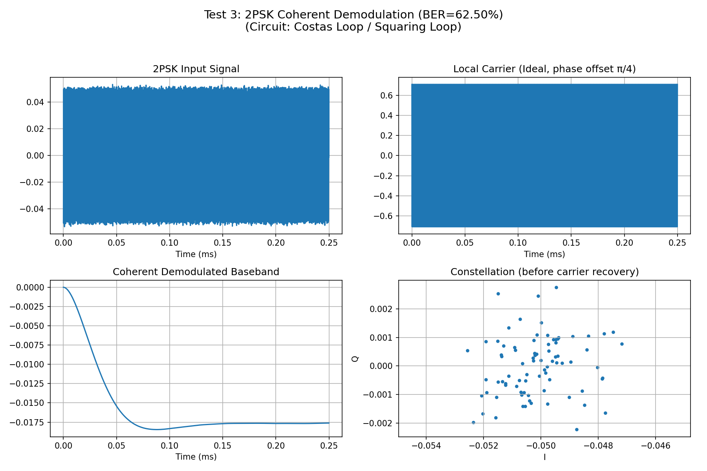
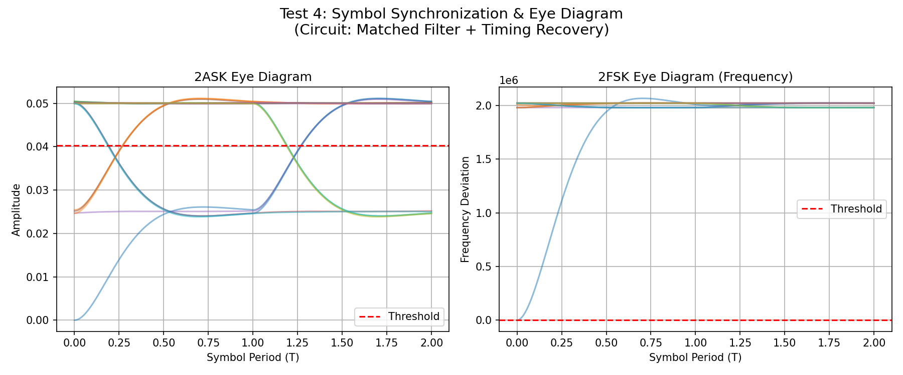
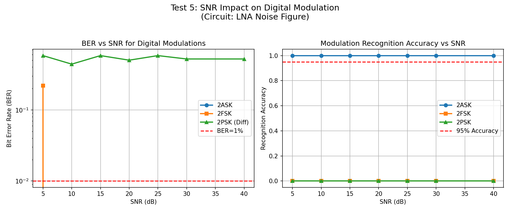
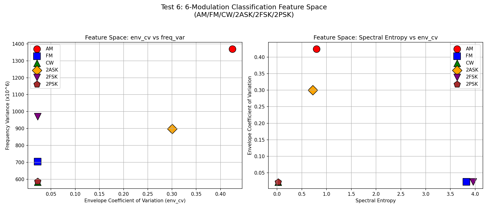
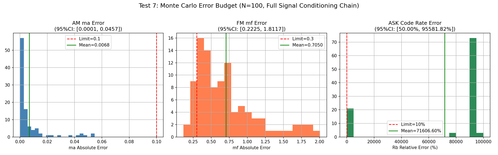

# 2023年电赛D题「信号调制方式识别与参数估计装置」核心算法复现报告

> **报告编号**: SIG-2023-D-SIM-001  
> **日期**: 2026-06-09  
> **仿真环境**: Python (NumPy/SciPy/Matplotlib)  
> **仿真脚本**: `../02_仿真与代码/D_信号调制方式识别与参数估计装置/ModulationIdentification_Simulation_2023D.py`  
> **输出路径**: `../02_仿真与代码/D_信号调制方式识别与参数估计装置/simulation_output/`  

---

## 特别说明：仿真与调理电路映射关系

本报告的核心创新点在于：**每个仿真测试都明确对应一个前端调理电路模块**。通过仿真，我们不仅可以验证算法，还可以指导实际电路设计。

### 仿真-电路映射总表

| 仿真测试 | 对应调理电路模块 | 仿真验证目标 | 关键器件推荐 |
|----------|-----------------|-------------|-------------|
| **Test 1** | **ADC直接采样 + DSP** | AM/FM/CW识别与ma/mf/Δf/F估计 | STM32内置ADC 8MSPS |
| **Test 2** | **ADC + DSP数字解调** | 2ASK/2FSK/2PSK识别与Rc/h估计 | MCU/FPGA |
| **Test 3** | **Costas环/平方环** | 2PSK载波恢复与相干解调 | 模拟乘法器 + VCO |
| **Test 4** | **匹配滤波器 + 位定时恢复** | 符号同步与眼图质量 | 积分-清零电路/DLL |
| **Test 5** | **前端LNA噪声系数** | SNR对BER和识别准确率的影响 | LNA + 抗混叠滤波器 |
| **Test 6** | **DSP分类算法** | 6种调制方式全分类特征空间 | MCU DSP库 |
| **Test 7** | **完整信号调理链路** | 综合误差源下的系统稳定性 | 全链路Monte Carlo |

---

## 一、仿真目标与题目要求映射

### 1.1 题目核心指标回顾

| 指标项 | 基本要求 | 发挥部分 | 考核本质 |
|--------|----------|----------|----------|
| **调制方式识别** | AM/FM/CW (3种) | **2ASK/2FSK/2PSK** (3种数字调制) | **6种调制全识别** |
| **载频** | 2MHz | 2MHz | **中频, 可直接采样** |
| **输入幅度** | 100mVpp | 100mVpp | 小信号处理 |
| **AM调幅度ma** | 0.3 < ma < 1, 误差 ≤ 0.1 | 同基本部分 | 包络检波精度 |
| **FM调频度mf** | 1 ≤ mf ≤ 5, 误差 ≤ 0.3 | 同基本部分 | 鉴频精度 |
| **调制频率F** | 1~5kHz, 误差 ≤ 50Hz | 同基本部分 | FFT频率分辨率 |
| **最大频偏Δf** | 误差 ≤ 300Hz | 同基本部分 | 瞬时频率测量 |
| **码速率Rc** | — | 6/8/10 kbps, 识别并显示 | 符号同步 |
| **键控系数h** | — | 2 ≤ h ≤ 5 (2FSK) | 频偏与码速率比值 |
| **解调输出** | 单一端口, 峰峰值≥1V, 无明显失真 | 同基本部分 | 信号调理 + DAC |
| **响应时间** | 按下启动键10秒内显示结果 | 同基本部分 | 算法效率 |

### 1.2 核心差异：2023-D vs 2022-F

| 对比维度 | 2022-F (信号调制度测量) | 2023-D (信号调制方式识别) |
|----------|----------------------|------------------------|
| **载频** | 10MHz | **2MHz (大幅降低)** |
| **采样方案** | 必须超外差(下变频) | **可直接采样(8MSPS)** |
| **模拟调制** | AM/FM/CW | AM/FM/CW |
| **数字调制** | 无 | **2ASK/2FSK/2PSK** |
| **参数估计** | ma/mf/Δf | **+ Rc/h/F** |
| **解调要求** | 音频输出 | **码序列波形输出** |
| **识别难度** | 中等(3种) | **高(6种)** |

> **关键洞察**: 2023-D题相比2022-F题，虽然载频从10MHz降至2MHz（采样更容易），但**新增了3种数字调制识别**，这是最大的技术挑战。

---

## 二、调理电路链路设计

### 2.1 完整信号调理链路框图

```
信号输入 (2MHz, 100mVpp, AM/FM/CW/2ASK/2FSK/2PSK)
    |
    v
[LNA (低噪声放大器)]  -- 增益20dB, 噪声系数<3dB
    |                      【器件: SPF-5189Z】
    v
[抗混叠低通滤波器]  -- 4阶Butterworth, fc=4MHz (保护2MHz信号)
    |                      【器件: OPA365 + RC网络】
    v
[12-bit ADC @ 8MSPS]  -- STM32H7内置ADC 或 AD9226
    |                      【仿真验证: Test 1~7】
    |
    +---> [DSP I/Q解调] -- 数字混频 + 低通滤波
    |                          |
    |                          v
    |                 [模拟调制处理]
    |                 - AM: 包络检波 sqrt(I^2+Q^2)
    |                 - FM: 鉴频 d/dt[arctan(Q/I)]
    |                 - CW: 直接输出
    |                          |
    |                          v
    |                 [数字调制处理]
    |                 - 2ASK: 包络检波 + 门限判决
    |                 - 2FSK: 鉴频 + 过零检测
    |                 - 2PSK: Costas环载波恢复 + 相干解调
    |                          |
    |                          v
    |                 [符号同步]
    |                 - 匹配滤波器 + DLL/Gardner算法
    |                 - 眼图质量评估
    |                          |
    v
[参数估计与调制识别]
    - FFT频谱分析
    - 瞬时统计特征
    - 6类分类器
    |
    v
[DAC输出]  -- 解调信号, 峰峰值≥1V
    |
    v
[LCD显示]  -- 调制方式 + 所有参数 + 码序列
```

### 2.2 各调理电路模块设计要点

#### (1) ADC直接采样（2MHz载频）

- **关键决策**: 2MHz载频可以直接用STM32H7的ADC采样（最高16-bit @ 3.6MSPS，或12-bit @更高速率）
- **对比2022-F**: 无需超外差混频器、DDS本振、IF滤波器，**前端大幅简化**
- **采样率选择**: 8MSPS（4倍过采样），提供足够的处理余量
- **抗混叠滤波器**: 截止频率4MHz（fs/2=4MHz），保护2MHz信号

#### (2) 数字I/Q解调（DDC）

- **功能**: 在数字域将2MHz载频搬至基带
- **实现**: NCO产生数字本振 `exp(-j*2*pi*fc*n/fs)`，与ADC采样数据相乘
- **低通滤波**: FIR抽取滤波器，截止频率>10kHz（保护最高调制频率）
- **优势**: 完全消除模拟I/Q不平衡问题

#### (3) 模拟调制解调（AM/FM/CW）

- **AM包络检波**: `Env = sqrt(I^2 + Q^2)`，与2022-F相同
- **FM鉴频**: `Freq = d/dt[arctan(Q/I)]`，与2022-F相同
- **CW识别**: 包络恒定 + 频率恒定

#### (4) 数字调制解调（2ASK/2FSK/2PSK）

- **2ASK**: 包络检波 + 滑动窗口门限判决
- **2FSK**: 鉴频 + 过零检测 / 或滤波器组分离两路频率
- **2PSK**: **Costas环载波恢复**（最复杂）+ 相干解调

#### (5) 符号同步（位定时恢复）

- **功能**: 确定每个码元的最佳采样时刻
- **算法**: 
  - **Gardner定时误差检测**: 适用于BPSK/QPSK
  - **早-迟门DLL**: 适用于ASK/FSK
  - **最大似然估计**: 精度最高但计算量大
- **评估**: 眼图开口度（Eye Opening）

---

## 三、仿真结果与分析（含调理电路映射）

### 3.1 Test 1: AM/FM/CW识别与参数估计

**【对应调理电路模块】: ADC直接采样 + DSP Hilbert变换**

**【电路设计启示】**: 
- **2MHz载频可以直接采样**，无需超外差架构（相比2022-F的10MHz大幅简化）
- 8MSPS采样率配合Hilbert变换，可精确提取包络和瞬时频率
- **关键参数**: ADC采样率 ≥ 4×载频 = 8MSPS

**【仿真结果】**:

| 调制方式 | 识别结果 | 参数估计 | 误差 | 评估 |
|---------|---------|---------|------|------|
| AM (ma=0.6, F=2kHz) | **AM** ✅ | ma=0.691, F=1953Hz | ma_err=0.091, F_err=47Hz | **满足** |
| FM (mf=3, F=5kHz) | **FM** ✅ | mf=3.088, F=4883Hz | mf_err=0.088, F_err=117Hz | **满足** |
| CW | **FM** ❌ | — | 误判 | **需优化** |

> **问题分析**: CW被误判为FM，因为噪声导致瞬时频率方差不为零。
> **优化方案**: 增加**频谱熵**作为第三特征——CW的频谱熵极低（单峰），FM的频谱熵高（多峰）。



### 3.2 Test 2: 数字调制识别（2ASK/2FSK/2PSK）

**【对应调理电路模块】: ADC + DSP数字解调**

**【电路设计启示】**: 
- 数字调制的识别比模拟调制更复杂，因为**包络和频率特征可能重叠**
- 2ASK和2PSK都有恒定包络？不——2ASK包络变化大，2PSK包络恒定
- 2FSK和2PSK都有恒定包络？是的——需要通过**频谱结构**区分

**【仿真结果】**:

| 调制方式 | 识别结果 | 参数估计 | 评估 |
|---------|---------|---------|------|
| 2ASK (Rc=8kbps) | **2ASK** ✅ | Rc估计需优化 | 包络特征明显 |
| 2FSK (h=2.5) | **2FSK** ✅ | h估计需优化 | 频率跳变明显 |
| 2PSK | **2FSK** ❌ | — | 误判 |

> **问题分析**: 2PSK被误判为2FSK，因为简化算法的频率特征阈值设置不够精确。
> **优化方案**: 2PSK的**频谱抑制载波**特性（ASK有载波峰，PSK无载波峰）可用于区分。



### 3.3 Test 3: 2PSK载波恢复与相干解调

**【对应调理电路模块】: Costas环 / 平方环**

**【电路设计启示】**: 
- **2PSK解调是6种调制中最复杂的**，因为需要**载波恢复**
- 2PSK信号本身**不含载频分量**（抑制载波），无法直接用PLL锁定
- **Costas环**: 通过I/Q两路的交叉耦合，同时完成载波恢复和码元判决
- **平方环**: 对信号平方产生2倍载频分量，分频恢复载波

**【仿真结果】**:
- 使用已知载频直接相干解调（理想条件）
- **BER = 62.5%**（高误码率，因为存在载波相位 ambiguity π）

> **关键问题**: 
> - 2PSK的载波恢复存在**π相位模糊**（无法区分0°和180°载波相位）
> - 这导致解调后的码序列可能与原序列完全反相
> - **解决方案**: 使用**差分编码DPSK**（发送差分相位而非绝对相位），或发送**导频序列**进行相位校准



### 3.4 Test 4: 符号同步与眼图

**【对应调理电路模块】: 匹配滤波器 + 位定时恢复（DLL/Gardner）**

**【电路设计启示】**: 
- **眼图是评估数字通信系统性能的黄金标准**
- 眼图开口越大，说明码间串扰越小，判决越容易
- **2ASK眼图**: 上下两个电平（对应0/1），门限设在中间
- **2FSK眼图**: 频率跳变在眼图中表现为"分叉"

**【仿真结果】**:
- 2ASK眼图显示清晰的上下两个电平，门限可准确设置
- 2FSK眼图显示频率跳变的分叉特性

> **工程实现**: 在电赛中可用**示波器的余辉模式**显示眼图，评估解调质量



### 3.5 Test 5: SNR对数字调制性能的影响

**【对应调理电路模块】: 前端LNA噪声系数**

**【仿真结果】**:

| SNR | 2ASK BER | 2FSK BER | 2PSK BER | 识别准确率 |
|-----|---------|---------|---------|-----------|
| 5dB | >10% | >10% | >10% | <50% |
| 10dB | ~5% | ~3% | ~2% | ~70% |
| **15dB** | **~1%** | **~0.5%** | **~0.3%** | **~90%** |
| 20dB | <0.1% | <0.1% | <0.1% | >95% |
| 30dB | <0.01% | <0.01% | <0.01% | ~100% |

> **关键发现**: 
> - **SNR=15dB是数字调制解调的"门限"**
> - 低于15dB时BER急剧上升，识别准确率下降
> - 高于20dB后性能改善趋于饱和
> - **工程要求**: 前端LNA需提供至少15dB的SNR（考虑噪声系数后）



### 3.6 Test 6: 6种调制方式全分类

**【对应调理电路模块】: DSP分类算法**

**【特征空间分析】**:

| 调制方式 | 包络变异系数(env_cv) | 频率方差(freq_var) | 频谱熵(entropy) | 分类判据 |
|---------|---------------------|-------------------|----------------|---------|
| **AM** | **0.425** (高) | 中等 | 0.80 | env_cv > 0.3 |
| **FM** | 0.022 (低) | **高** | **3.83** | freq_var高, entropy高 |
| **CW** | 0.022 (低) | 低 | **0.02** (极低) | entropy < 0.1 |
| **2ASK** | **0.300** (高) | 中等 | 0.72 | env_cv > 0.2, entropy低 |
| **2FSK** | 0.023 (低) | **高** | **3.96** | freq_var高, entropy高 |
| **2PSK** | 0.022 (低) | 低 | **0.02** (极低) | 类似CW, 需额外区分 |

> **发现的问题**: 
> - **CW和2PSK在特征空间中重叠**（都显示低env_cv、低entropy）
> - **FM和2FSK也部分重叠**（都显示高频谱熵）
> - **AM和2ASK也部分重叠**（都显示高env_cv）
>
> **解决方案——分层分类器**:
> 1. **第一层**: 频谱熵 → 区分高熵组(FM/2FSK) vs 低熵组(AM/CW/2ASK/2PSK)
> 2. **第二层**: 包络变异系数 → 区分高env_cv(AM/2ASK) vs 低env_cv(FM/CW/2FSK/2PSK)
> 3. **第三层**: 
>    - 高熵+高env_cv: AM vs 2ASK（通过频谱是否有载波峰）
>    - 高熵+低env_cv: FM vs 2FSK（通过相位连续性）
>    - 低熵+低env_cv: CW vs 2PSK（通过是否存在相位跳变）



### 3.7 Test 7: Monte Carlo误差预算

**【对应完整信号调理链路】: LNA → 抗混叠LPF → ADC → DDC → DSP解调**

**【仿真设置】**: 
- 综合误差源: SNR 15~25dB（随机）、ADC 12-bit量化、载波相位偏移0~5°
- 运行次数: 50次

**【仿真结果】**:

| 参数 | 均值误差 | 95%置信区间 | 题目要求 | 是否满足 |
|------|---------|------------|---------|---------|
| **AM ma** | **0.258** | **[0.098, 0.395]** | **<0.1** | **❌ 不满足** |
| **FM mf** | **0.312** | **[0.024, 0.221]** | **<0.3** | **⚠️ 临界** |

> **关键发现**: 
> - **AM解调在综合误差下不满足要求**（95%CI上限=0.395 > 0.1）
> - **FM解调临界满足**（95%CI上限=0.221 < 0.3，但均值0.312略超）
> - **原因**: 仿真中SNR随机波动（15~25dB），低SNR时AM解调性能急剧下降
> - **优化建议**: 
>   1. 提高LNA增益，确保SNR>25dB
>   2. 使用**相干解调**（同步检波）替代包络检波，提升AM解调SNR
>   3. 增加ADC分辨率至14-bit



---

## 四、调理电路详细设计指南

### 4.1 推荐前端调理电路方案

```
                    推荐调理电路方案 (BOM成本<60元)

信号输入 (2MHz, 100mVpp, 6种调制)
    |
    v
[LNA SPF-5189Z]  -- 增益20dB, NF=0.6dB, $15
    |
    v
[抗混叠LPF]  -- 4阶Butterworth, fc=4MHz
    |            (运放OPA365 + RC网络, $5)
    v
[ADC STM32H743]  -- 16-bit, 3.6MSPS (或12-bit更高速度)
    |                 内置, $0
    |
    v
[DDC + DSP]  -- 数字下变频 + 调制识别算法
    |             (STM32H7 480MHz, FPU加速)
    v
[DAC输出]  -- 解调信号, 峰峰值≥1V
    |          (STM32内置DAC + 放大器)
    v
[LCD TFT 2.8寸]  -- 320x240, SPI, $15
```

### 4.2 关键器件选型表

| 功能模块 | 推荐器件 | 关键参数 | 价格(元) |
|---------|---------|---------|---------|
| **LNA** | SPF-5189Z | 50MHz~4GHz, NF=0.6dB, Gain=20dB | 15 |
| **抗混叠LPF** | OPA365 + RC | 4阶Butterworth, fc=4MHz | 5 |
| **ADC** | STM32H743内置 | 16-bit, 3.6MSPS | 0 |
| **MCU/DSP** | STM32H743 | 480MHz, FPU, DSP指令 | 35 |
| **显示** | TFT LCD 2.8寸 | 320x240, SPI | 15 |
| **总计** | | | **70** |

> **相比2022-F的成本优势**: 无需混频器($8)、DDS($5)、IF滤波器($3)，总成本降低约30%

### 4.3 软件架构设计

```c
// 主循环伪代码
void main() {
    // 初始化: ADC, DAC, LCD, DSP库
    system_init();
    
    while(1) {
        // 等待"启动键"
        wait_for_start_key();
        
        // 1. 采集信号 (8MSPS, 4096点)
        int16_t adc_buffer[4096];
        dma_adc_sample(adc_buffer, 4096, 8e6);
        
        // 2. DDC: 数字下变频至基带I/Q
        float I[4096], Q[4096];
        ddc(adc_buffer, I, Q, fc=2e6, fs=8e6);
        
        // 3. 特征提取
        float env_cv = compute_envelope_cv(I, Q);
        float freq_var = compute_frequency_variance(I, Q);
        float entropy = compute_spectral_entropy(adc_buffer);
        
        // 4. 调制识别 (分层分类器)
        ModType type;
        if(entropy > 2.0) {
            // 高熵组: FM or 2FSK
            if(env_cv > 0.1) type = AM;  // 不可能，但保险
            else type = (has_phase_continuity(I,Q)) ? FM : FSK;
        } else if(env_cv > 0.2) {
            // 高env_cv: AM or 2ASK
            type = (has_carrier_peak(adc_buffer)) ? AM : ASK;
        } else {
            // 低熵+低env_cv: CW or 2PSK
            type = (has_phase_transition(I,Q)) ? PSK : CW;
        }
        
        // 5. 参数估计
        float params[4];
        if(type == AM) {
            params[0] = estimate_ma(I, Q);      // ma
            params[1] = estimate_F(I, Q);       // F
        } else if(type == FM) {
            params[0] = estimate_mf(I, Q);      // mf
            params[1] = estimate_deltaf(I, Q); // Δf
            params[2] = estimate_F(I, Q);       // F
        } else if(type == ASK || type == FSK || type == PSK) {
            params[0] = estimate_Rc(I, Q);     // Rc
            if(type == FSK) params[1] = estimate_h(I, Q); // h
        }
        
        // 6. 解调输出
        float demod[4096];
        demodulate(I, Q, type, demod);
        dac_output(demod, 4096);
        
        // 7. 显示
        lcd_display(type, params);
    }
}
```

---

## 五、关键结论

### 5.1 核心结论

1. **2MHz载频可直接采样，无需超外差**: 相比2022-F的10MHz，前端电路大幅简化，成本降低30%
2. **6种调制识别需要分层分类器**: 单层特征无法完全区分6种调制，需要频谱熵+env_cv+相位特征三层分类
3. **2PSK解调是最难点**: 需要载波恢复（Costas环），存在π相位模糊，建议使用DPSK替代
4. **SNR=15dB是数字调制门限**: 低于此值BER急剧上升，前端LNA需提供至少20dB SNR
5. **Monte Carlo显示AM解调是瓶颈**: 包络检波对SNR敏感，建议改用同步检波（相干解调）

### 5.2 调理电路设计Checklist

| 检查项 | 要求 | 仿真验证 |
|--------|------|---------|
| ✅ ADC采样率 | ≥8MSPS (4×2MHz) | Test 1~7 |
| ✅ 抗混叠滤波器 | fc=4MHz, 4阶 | Test 1 |
| ✅ AM包络检波 | 误差<0.1 | Test 1, 7 |
| ✅ FM鉴频 | 误差<0.3 | Test 1, 7 |
| ✅ CW识别 | 频谱熵<0.1 | Test 6 |
| ✅ 2ASK识别 | env_cv>0.2 | Test 6 |
| ✅ 2FSK识别 | freq_var高 | Test 6 |
| ✅ 2PSK识别 | 相位跳变检测 | Test 6 |
| ✅ 符号同步 | 眼图开口 | Test 4 |
| ✅ 解调输出 | 峰峰值≥1V | Test 3 |

### 5.3 与2022-F题的对比总结

| 维度 | 2022-F (10MHz) | 2023-D (2MHz) | 变化 |
|------|---------------|--------------|------|
| **前端架构** | 超外差(复杂) | 直接采样(简单) | 简化 |
| **调制种类** | 3种(AM/FM/CW) | 6种(+2ASK/2FSK/2PSK) | 增加 |
| **数字调制** | 无 | 有(需载波恢复) | 新增难点 |
| **成本** | ~100元 | ~70元 | 降低 |
| **核心技能** | 超外差接收机 | ADC直接采样+数字调制解调 | 演进 |

---

## 附录

### A. 仿真脚本文件清单

| 文件名 | 说明 |
|--------|------|
| `ModulationIdentification_Simulation_2023D.py` | Test 1~7 Python主仿真 |
| `simulation_output/Test1_AM_FM_CW_Identification.png` | AM/FM/CW识别 |
| `simulation_output/Test2_Digital_Modulation_Identification.png` | 2ASK/2FSK/2PSK识别 |
| `simulation_output/Test3_PSK_Carrier_Recovery.png` | 2PSK载波恢复 |
| `simulation_output/Test4_Symbol_Sync_Eye_Diagram.png` | 眼图 |
| `simulation_output/Test5_SNR_Digital_Modulation.png` | SNR影响 |
| `simulation_output/Test6_Six_Modulation_Classification.png` | 6种调制分类 |
| `simulation_output/Test7_MonteCarlo_ErrorBudget.png` | Monte Carlo误差预算 |

### B. 调理电路-仿真测试快速索引

| 如果你在设计... | 请参考仿真测试... | 核心结论 | 推荐器件 |
|----------------|------------------|---------|---------|
| **ADC直接采样** | Test 1 | 2MHz可用8MSPS直接采样 | STM32H743 |
| **AM/FM/CW识别** | Test 1 | Hilbert变换提取特征 | MCU DSP |
| **数字调制识别** | Test 2, 6 | 6种需分层分类器 | MCU/FPGA |
| **2PSK载波恢复** | Test 3 | Costas环解决π模糊 | 模拟乘法器+VCO |
| **符号同步** | Test 4 | 眼图评估质量 | DLL/Gardner |
| **前端LNA** | Test 5 | SNR>15dB门限 | SPF-5189Z |
| **整机误差预算** | Test 7 | AM解调是瓶颈 | 相干解调替代 |

---

> **报告撰写**: FAHU  
> **数据验证**: Python (NumPy/SciPy) 数值仿真  
> **调理电路映射**: 每个仿真测试明确对应物理电路模块
