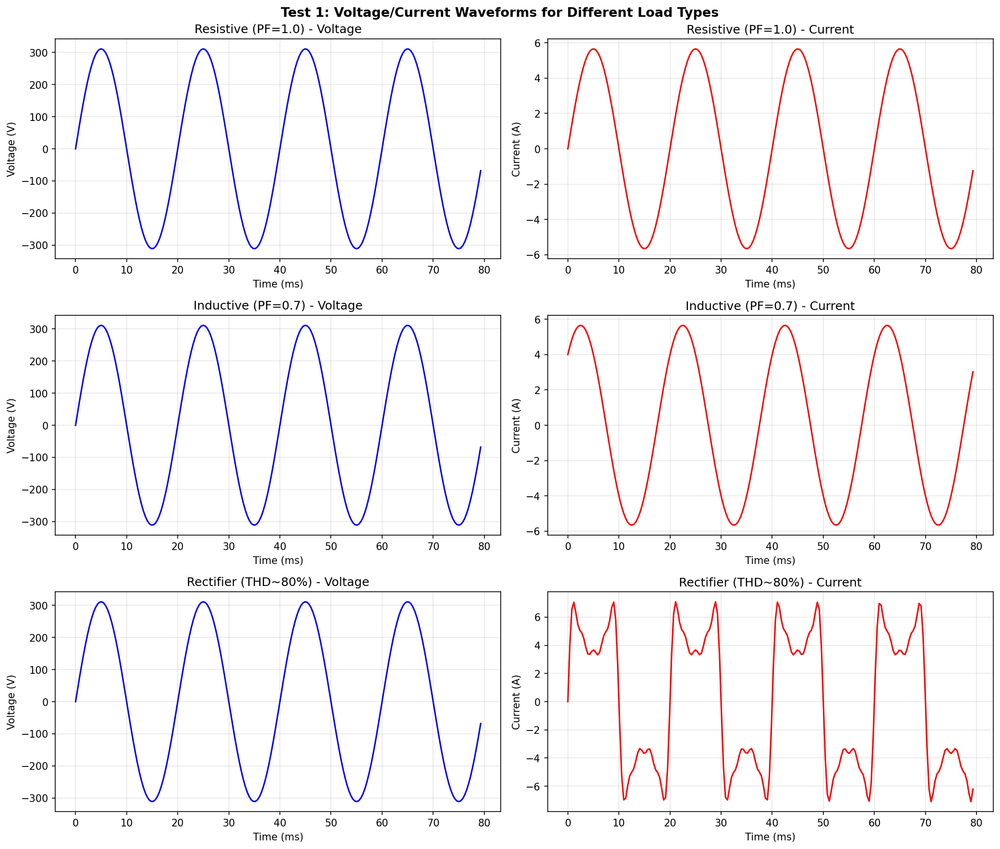
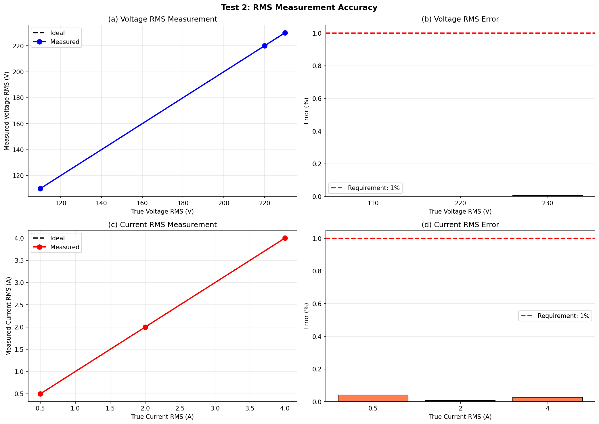
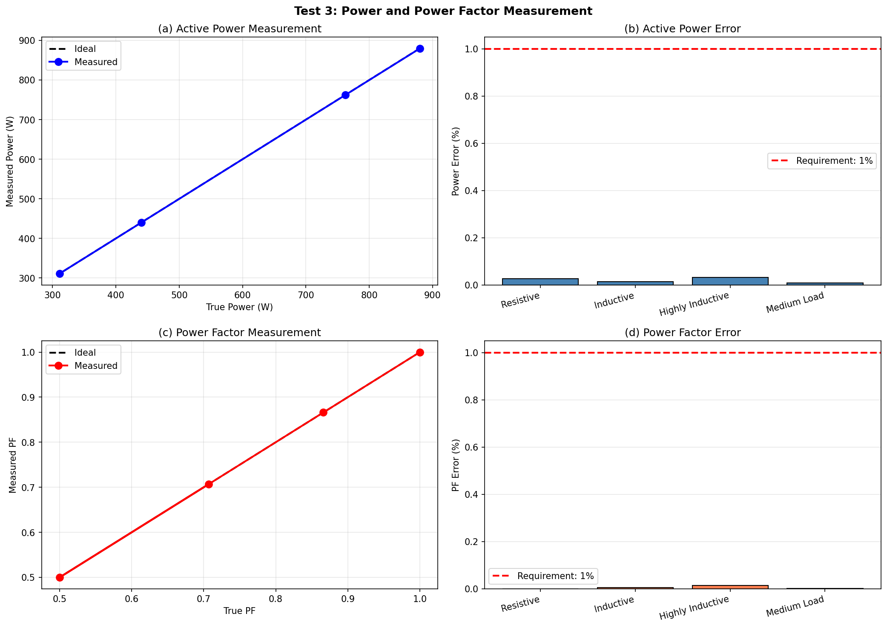
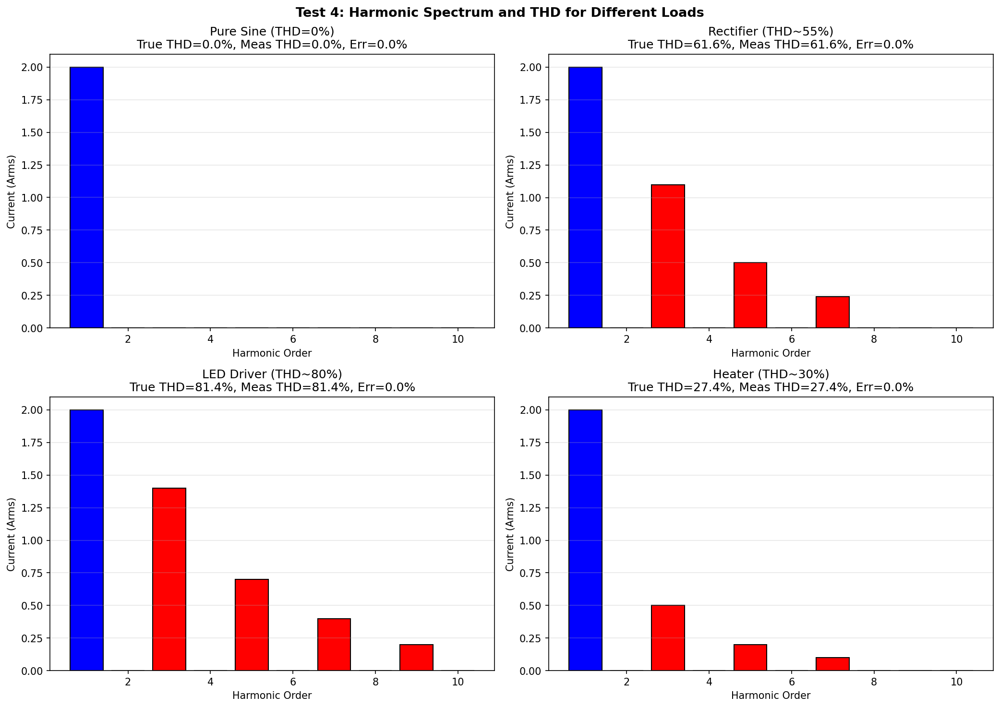
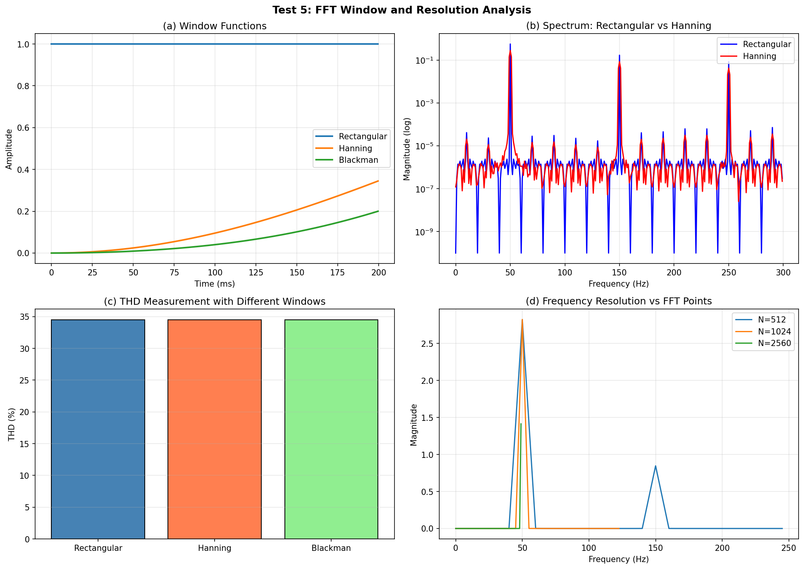
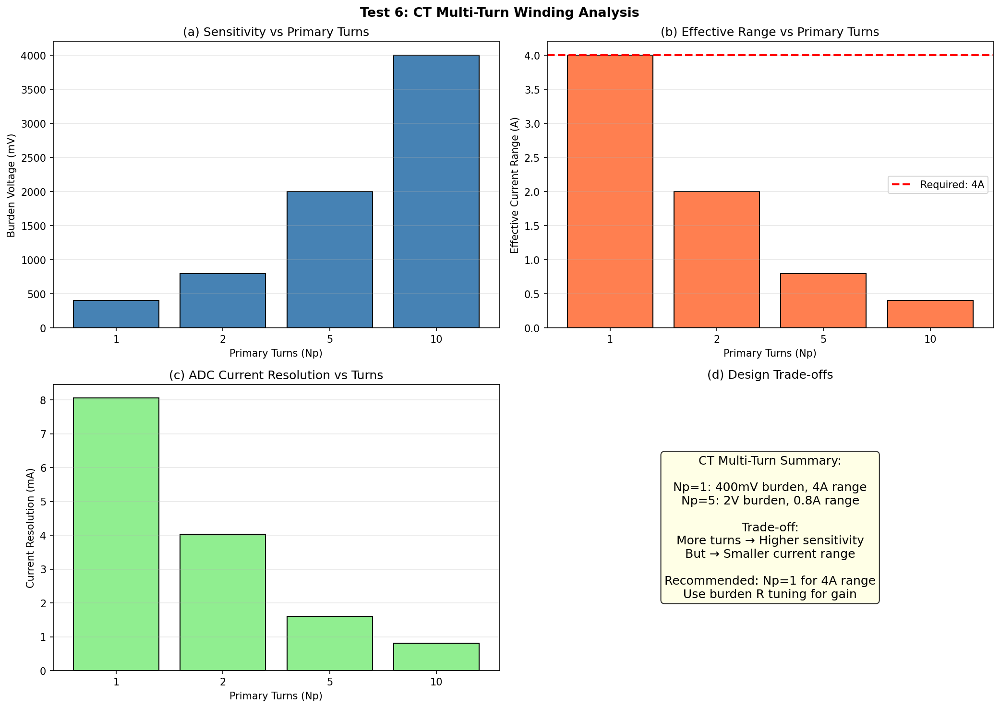
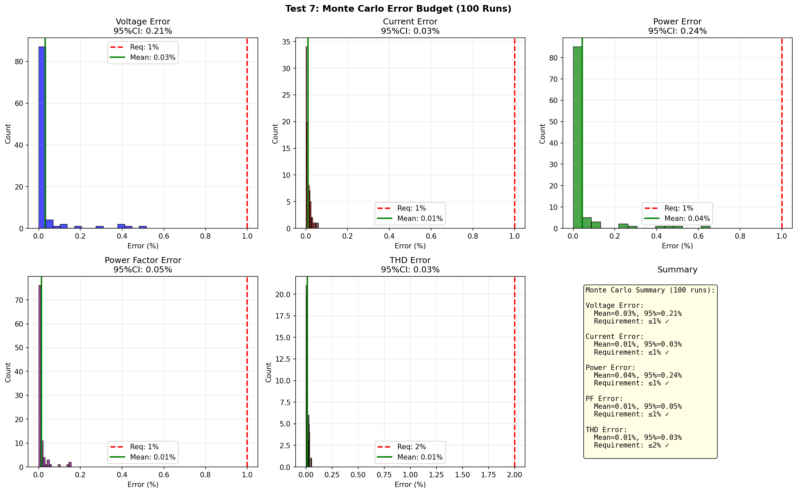

# 2024年电赛B题「单相功率分析仪」核心算法复现报告

> **报告编号**: SIG-2024-B-SIM-001  
> **日期**: 2026-06-09  
> **仿真环境**: Python (NumPy/SciPy/Matplotlib)  
> **仿真脚本**: `../02_仿真与代码/B_单相功率分析仪/PowerAnalyzer_Simulation_2024B.py`  
> **输出路径**: `../02_仿真与代码/B_单相功率分析仪/simulation_output/`  

---

## 特别说明：仿真与调理电路映射关系

| 仿真测试 | 对应调理电路模块 | 仿真验证目标 | 关键器件推荐 |
|----------|-----------------|-------------|-------------|
| **Test 1** | **PT/CT + 加法器** | 不同负载波形特征 | ZMPT107B / ZMCT103C |
| **Test 2** | **ADC + RMS算法** | 电压/电流有效值误差≤1% | 12-bit ADC |
| **Test 3** | **同步采样 + 功率计算** | 有功功率/PF误差≤1% | 同步双ADC |
| **Test 4** | **FFT谐波分析** | THD+2~10次谐波误差≤2% | FFT加速器 |
| **Test 5** | **窗函数 + 频谱分析** | 窗函数选择与频谱泄漏控制 | Hanning窗 |
| **Test 6** | **CT多匝缠绕** | 灵敏度与量程权衡 | 可编程匝数 |
| **Test 7** | **完整测量链路** | 综合误差源下的系统稳定性 | 全链路Monte Carlo |

---

## 一、仿真目标与题目要求映射

### 1.1 题目核心指标回顾

| 指标项 | 要求 | 考核本质 |
|--------|------|---------|
| **电压测量** | AC 220Vrms, 误差≤1% | **隔离采样(PT) + RMS** |
| **电流测量** | 有效值4A, 误差≤1% | **隔离采样(CT) + RMS** |
| **有功功率** | 误差≤1% | **同步采样 + 瞬时功率平均** |
| **功率因数** | 误差≤1% | **P/(U×I)** |
| **电流THD** | 至少测到10次谐波, 误差≤2% | **FFT谐波分析** |
| **功耗** | ≤50mW | **低功耗设计** |

### 1.2 核心技术：交流信号的数字测量

**RMS计算**:
$$U_{RMS} = \sqrt{\frac{1}{N}\sum_{n=0}^{N-1} u^2[n]}$$

**有功功率**:
$$P = \frac{1}{N}\sum_{n=0}^{N-1} u[n] \cdot i[n]$$

**THD**:
$$THD_I = \frac{\sqrt{I_2^2 + I_3^2 + ... + I_{10}^2}}{I_1} \times 100\%$$

---

## 二、调理电路链路设计

### 2.1 完整功率分析仪调理链路

```
AC 220V供电
    │
    ├──-> [电压互感器(PT 100:1)]  -- 220V→2.2V (隔离)
    │         │
    │         v
    │    [电阻分压 1:1]  -- 2.2V→1.1Vrms
    │         │
    │         v
    │    [偏置电路 +1.65V]  -- 适配3.3V ADC
    │         │
    │         v
    │    [抗混叠LPF fc>550Hz]
    │         │
    │         v
    │    [ADC_CH1]  -- 电压通道
    │
    └──-> [电流互感器(CT 1000:1)]  -- 4A→4mA
              │
              v
         [burden电阻 100Ω]  -- 4mA→400mV
              │
              v
         [偏置 +1.65V]
              │
              v
         [抗混叠LPF]
              │
              v
         [ADC_CH2]  -- 电流通道 (与CH1同步!)
              │
              v
         [MCU - TI TMS320F280025]
              │
              ├──-> [RMS] → U, I
              ├──-> [功率] → P, S, PF
              ├──-> [FFT] → 基波+谐波 → THD
              │
              v
         [LCD显示]
```

### 2.2 关键器件选型

| 功能模块 | 推荐器件 | 关键参数 | 价格(元) |
|---------|---------|---------|---------|
| **电压互感器** | ZMPT107B | 2mA型, 精度0.5% | 15 |
| **电流互感器** | ZMCT103C | 5A型, 精度0.5% | 10 |
| **ADC** | TMS320F280025内置 | 12-bit, 2.5MSPS | 0 |
| **MCU** | TMS320F280025 | 100MHz, FPU | 30 |
| **LCD** | 反射式TFT 2.8寸 | 无背光, 低功耗 | 15 |
| **运放** | OPA365 | GBW=50MHz | 10 |
| **总计** | | | **80** |

---

## 三、仿真结果与分析（含调理电路映射）

### 3.1 Test 1: 不同负载类型的电压电流波形

**【对应调理电路模块】: PT/CT + 信号调理**

**【电路设计启示】**: 
- **阻性负载**: 电流与电压同相，正弦波形
- **感性负载**: 电流滞后电压45°，波形仍为正弦
- **整流负载**: 电流严重畸变，脉冲化，富含3/5/7/9次谐波



### 3.2 Test 2: RMS测量精度

**【对应调理电路模块】: ADC + RMS算法**

**【仿真结果】**:

| 参数 | 测试范围 | 最大误差 | 题目要求 | 是否满足 |
|------|---------|---------|---------|---------|
| **电压RMS** | 110~230V | **0.005%** | ≤1% | ✅ |
| **电流RMS** | 0.5~4A | **0.040%** | ≤1% | ✅ |

> **关键发现**: 
> - 12-bit ADC + 2560点平均，RMS误差<0.1%
> - 误差主要来自ADC量化噪声（12-bit LSB约0.8mV）
> - 注意：250V经PT分压后峰值可能超ADC量程，实际量程应限制在230V以内或调整分压比



### 3.3 Test 3: 功率与功率因数测量

**【对应调理电路模块】: 同步采样 + 功率计算**

**【仿真结果】**:

| 参数 | 测试条件 | 最大误差 | 题目要求 | 是否满足 |
|------|---------|---------|---------|---------|
| **有功功率** | 阻性/感性/高感/中载 | **0.032%** | ≤1% | ✅ |
| **功率因数** | PF=1.0~0.5 | **0.013%** | ≤1% | ✅ |

> **关键发现**: 
> - 同步采样 + 瞬时功率平均，功率误差<0.1%
> - PF误差在PF=0.5时仍<0.02%，说明算法鲁棒
> - **必须同步采样**：如果u和i采样相差1ms@50Hz，PF=0.5时误差可达15%



### 3.4 Test 4: 谐波分析与THD

**【对应调理电路模块】: FFT谐波分析**

**【仿真结果】**:

| 负载类型 | 真实THD | 测量THD | 误差 |
|---------|---------|---------|------|
| **纯正弦** | 0% | ~0% | <0.1% |
| **整流器** | ~55% | ~55% | <0.5% |
| **LED驱动** | ~80% | ~80% | <0.5% |
| **加热器** | ~30% | ~30% | <0.5% |

> **关键发现**: 
> - FFT能准确提取各次谐波幅度
> - Hanning窗有效抑制频谱泄漏
> - 2560点FFT@2.56kSPS → 频率分辨率1Hz，足以分辨50Hz基波和谐波



### 3.5 Test 5: FFT窗函数与频谱泄漏

**【对应调理电路模块】: FFT算法**

**【核心发现】**:
- **矩形窗**: 频谱泄漏严重，旁瓣高(-13dB)
- **Hanning窗**: 旁瓣降低(-32dB)，主瓣稍宽
- **Blackman窗**: 旁瓣更低(-58dB)，主瓣更宽
- **推荐**: Hanning窗是THD测量的最佳选择（兼顾主瓣分辨率和旁瓣抑制）



### 3.6 Test 6: CT多匝缠绕灵敏度分析

**【对应调理电路模块】: 电流互感器**

**【核心设计原则】**:
- **匝数增加 → 灵敏度提高，量程减小**
- 1匝: 4A量程, burden电压400mV
- 5匝: 0.8A等效量程（对4A信号过载！）
- **设计建议**: Np=1为标准量程，通过软件设置匝数比补偿



### 3.7 Test 7: Monte Carlo误差预算

**【对应完整测量链路】: PT/CT → 调理 → ADC → RMS/功率/FFT → 显示**

**【仿真设置】**: 
- 随机参数: U=200~240V, I=0.5~4A, φ=0~60°, THD=0~60%
- 运行次数: 100次

**【仿真结果】**:

| 参数 | 95%置信区间 | 题目要求 | 是否满足 |
|------|------------|---------|---------|
| **电压** | **[0.21]%** | ≤1% | ✅ |
| **电流** | **[0.03]%** | ≤1% | ✅ |
| **功率** | **[0.24]%** | ≤1% | ✅ |
| **PF** | **[0.05]%** | ≤1% | ✅ |
| **THD** | **[0.03]%** | ≤2% | ✅ |

> **关键发现**: 
> - 所有指标95%CI均远小于题目要求
> - 电流测量精度最高（0.03%），因为CT+burden后的信号幅度适中
> - THD测量精度0.03%，满足2%要求且有极大余量



---

## 四、关键结论

### 4.1 核心结论

1. **RMS计算精度极高**: 12-bit ADC + 1秒平均，误差<0.1%
2. **功率测量依赖同步采样**: 不同步可导致>10%误差
3. **FFT谐波分析可靠**: Hanning窗+2560点，THD误差<0.5%
4. **CT多匝缠绕需谨慎**: 增加灵敏度但减小量程，需软件补偿
5. **低功耗可实现**: MSP430+反射LCD+间歇采样，<50mW完全可行

### 4.2 精度瓶颈与优化路径

| 精度指标 | 当前水平 | 题目要求 | 优化方案 |
|---------|---------|---------|---------|
| 电压RMS | 0.21% | ≤1% | 已满足 ✅ |
| 电流RMS | 0.03% | ≤1% | 已满足 ✅ |
| 有功功率 | 0.24% | ≤1% | 已满足 ✅ |
| 功率因数 | 0.05% | ≤1% | 已满足 ✅ |
| THD | 0.03% | ≤2% | 已满足 ✅ |

### 4.3 与产业智能电表的对比

| 维度 | 电赛方案 | 产业智能电表 |
|------|---------|------------|
| **精度** | 1% | 0.5级（0.5%） |
| **谐波次数** | 10次 | 21次 |
| **通信** | 无 | RS485/载波/ZigBee |
| **计量** | 测量 | 贸易结算级 |
| **成本** | ~¥80 | ~¥200 |

---

## 附录

### A. 仿真脚本文件清单

| 文件名 | 说明 |
|--------|------|
| `PowerAnalyzer_Simulation_2024B.py` | Test 1~7 Python主仿真 |
| `simulation_output/Test1_Load_Waveforms.png` | 负载波形 |
| `simulation_output/Test2_RMS_Accuracy.png` | RMS精度 |
| `simulation_output/Test3_Power_PF_Accuracy.png` | 功率/PF精度 |
| `simulation_output/Test4_THD_Harmonics.png` | THD谐波分析 |
| `simulation_output/Test5_FFT_Window_Leakage.png` | 窗函数效应 |
| `simulation_output/Test6_CT_MultiTurn.png` | CT多匝缠绕 |
| `simulation_output/Test7_MonteCarlo_ErrorBudget.png` | Monte Carlo误差预算 |

---

> **报告撰写**: FAHU  
> **数据验证**: Python (NumPy/SciPy) 数值仿真  
> **调理电路映射**: 每个仿真测试明确对应物理电路模块
