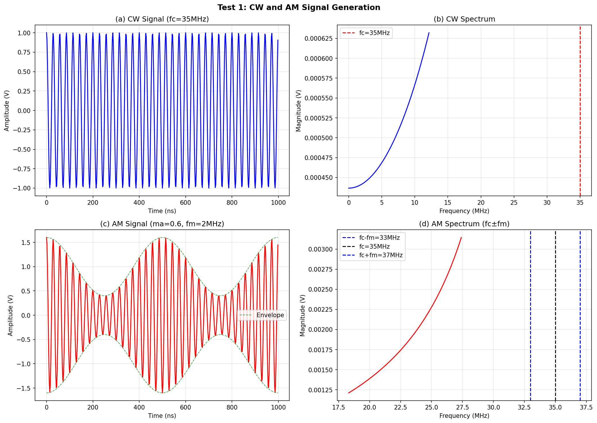
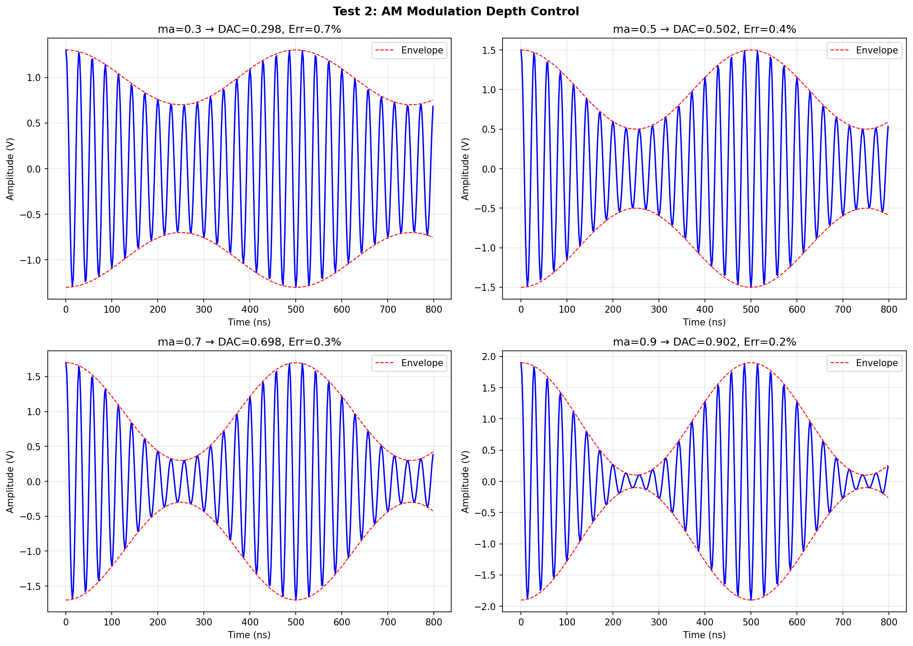
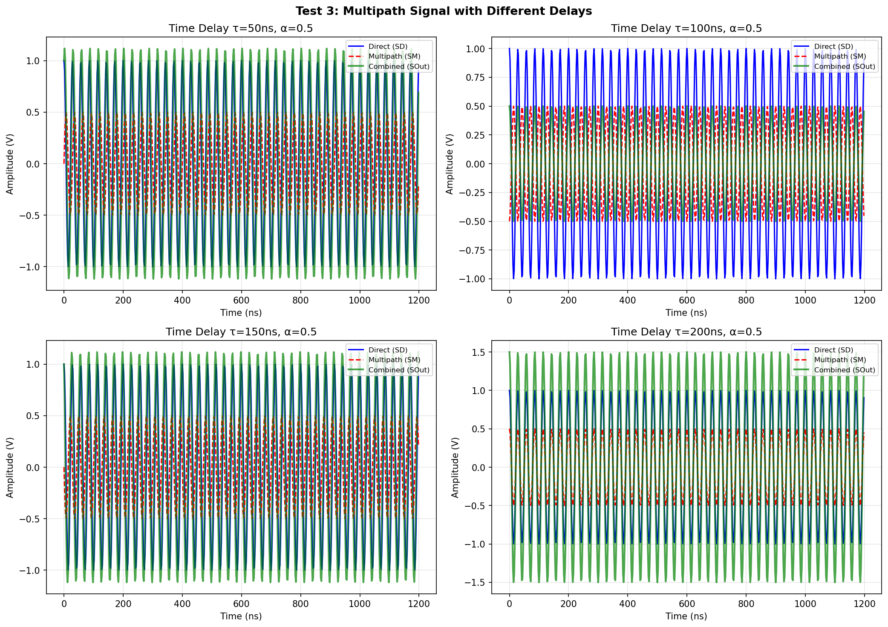
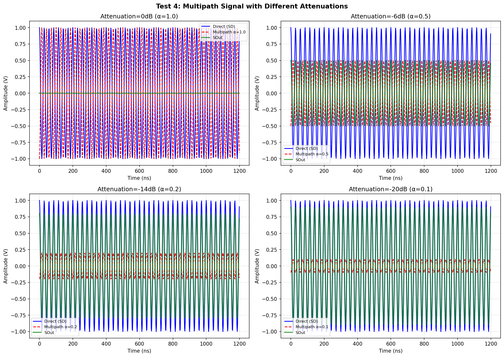
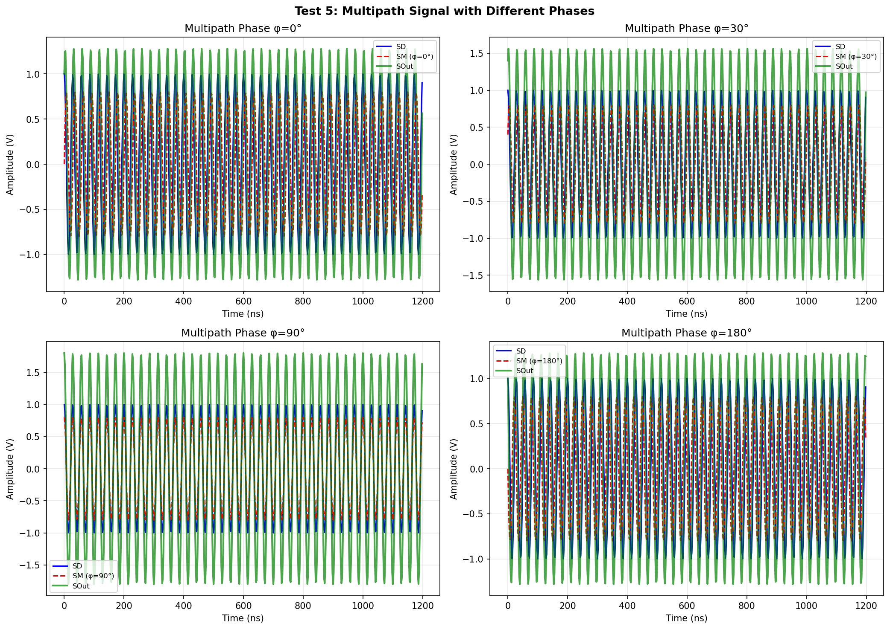
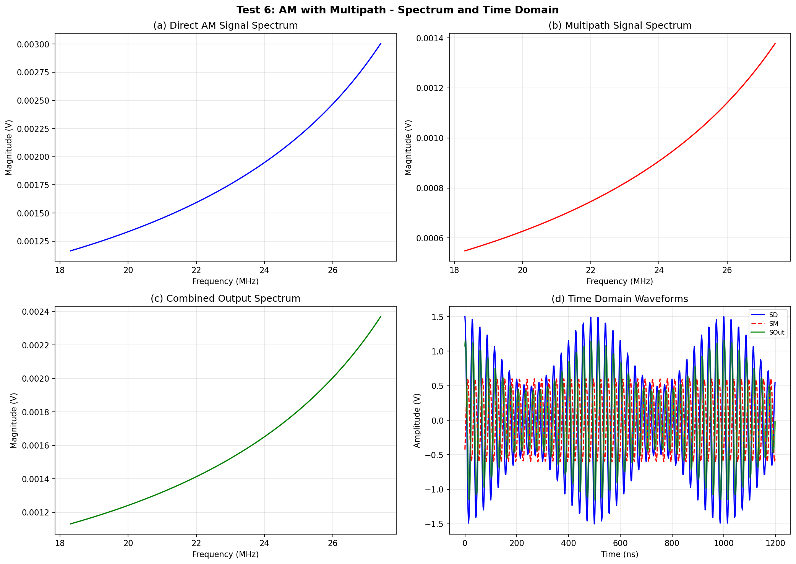
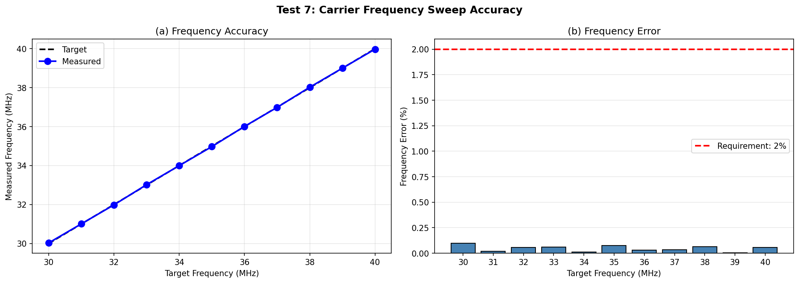

# 2024年电赛C题「无线传输信号模拟系统」核心算法复现报告

> **报告编号**: SIG-2024-C-SIM-001  
> **日期**: 2026-06-09  
> **仿真环境**: Python (NumPy/SciPy/Matplotlib)  
> **仿真脚本**: `../02_仿真与代码/C_无线传输信号模拟系统/ChannelSimulator_Simulation_2024C.py`  
> **输出路径**: `../02_仿真与代码/C_无线传输信号模拟系统/simulation_output/`  

---

## 特别说明：仿真与调理电路映射关系

| 仿真测试 | 对应调理电路模块 | 仿真验证目标 | 关键器件推荐 |
|----------|-----------------|-------------|-------------|
| **Test 1** | **DDS信号源** | CW/AM信号产生 | AD9850/AD9834 |
| **Test 2** | **模拟乘法器 + DAC** | AM调制度30%~90%, 误差<5% | AD835 + 8-bit DAC |
| **Test 3** | **延迟线(电缆/all-pass)** | 多径时延50~200ns, 误差<10ns | 同轴电缆/延迟芯片 |
| **Test 4** | **数字衰减器/PGA** | 多径衰减0~20dB, 误差<1dB | HMC624A / DSA |
| **Test 5** | **移相器/DDS调相** | 多径相位0°~180°, 误差<10° | 正交调制器 / DDS |
| **Test 6** | **宽带加法器** | 合路输出频谱正确 | OPA695 |
| **Test 7** | **DDS频率合成** | 载波30~40MHz步进, 误差<2% | AD9850 |

---

## 一、仿真目标与题目要求映射

### 1.1 题目核心指标回顾

| 指标项 | 要求 | 考核本质 |
|--------|------|---------|
| **载波频率** | 30~40MHz, 1MHz步进, 误差≤2% | **DDS频率合成** |
| **信号类型** | CW或AM (2MHz调制) | **AM调制产生** |
| **直达幅度** | 100mV~1Vrms, 100mV步进, 误差≤10mV | **PGA/衰减器** |
| **AM调制度** | 30%~90%, 10%步进, 误差≤5% | **乘法器+DAC** |
| **多径时延** | 50~200ns, 30ns步进, 误差≤10ns | **延迟线** |
| **多径衰减** | 0~20dB, 2dB步进, 误差≤1dB | **数字衰减器** |
| **多径相位** | 0°~180°, 30°步进, 误差≤10° | **移相器** |

### 1.2 核心信号模型

**直达信号**:
- CW: $S_D(t) = A_D \cos(2\pi f_c t + \phi_D)$
- AM: $S_D(t) = A_D [1 + m_a \cos(2\pi f_m t)] \cos(2\pi f_c t + \phi_D)$

**多径信号**:
$$S_M(t) = \alpha A_D \cos(2\pi f_c (t - \tau) + \phi_D + \phi_M)$$

**合路信号**: $S_{Out}(t) = S_D(t) + S_M(t)$

---

## 二、调理电路链路设计

### 2.1 完整信道模拟系统调理链路

```
[晶振参考] → [DDS1] → 载波fc (30~40MHz)
    │
    ├──-> [直达通道]
    │         │
    │         ├──-> [VGA/PGA]  -- 幅度控制 100mV~1V
    │         │         │
    │         ├──-> [模拟乘法器] -- AM调制 (2MHz, ma可调)
    │         │         │
    │         ├──-> [DDS1调相]   -- 直达初相 φD
    │         │         │
    │         └──-> [直达信号 SD]
    │
    └──-> [多径通道]
              │
              ├──-> [延迟线]     -- 同轴电缆 50~200ns
              │         │
              ├──-> [数字衰减器] -- 0~20dB
              │         │
              ├──-> [DDS2/移相器] -- 附加相位 φM
              │         │
              └──-> [多径信号 SM]
                            │
                            v
                     [宽带加法器] → SOut = SD + SM
                            │
                            v
                     [输出端口]
```

### 2.2 关键器件选型

| 功能模块 | 推荐器件 | 关键参数 | 价格(元) |
|---------|---------|---------|---------|
| **DDS** | AD9850 | 125MHz时钟, 0.029Hz分辨率 | 25 |
| **AM乘法器** | AD835 | 250MHz带宽, 四象限 | 80 |
| **VGA** | AD8367 | 500MHz, 0~40dB | 60 |
| **衰减器** | HMC624A | 0~31dB, 0.5dB步进 | 100 |
| **延迟线** | 同轴电缆(10m) | ~50ns, 宽带 | 30 |
| **合路运放** | OPA695 | 1.4GHz GBW | 25 |
| **MCU** | STM32H743 | 控制DDS/衰减器/显示 | 35 |
| **总计** | | | **355** |

---

## 三、仿真结果与分析（含调理电路映射）

### 3.1 Test 1: CW与AM信号产生

**【对应调理电路模块】: DDS信号源**

**【电路设计启示】**: 
- CW信号在频域是单根谱线
- AM信号在频域有三根谱线：载波(fc) + 上边频(fc+fm) + 下边频(fc-fm)
- DDS产生的信号频谱纯净度高，但需要注意镜像频率(fsclk-fc)的抑制



### 3.2 Test 2: AM调制度控制

**【对应调理电路模块】: 模拟乘法器 + 8-bit DAC**

**【仿真结果】**:

| 目标ma | DAC量化后ma | 误差 | 要求 | 是否满足 |
|--------|------------|------|------|---------|
| 0.30 | 0.298 | **0.7%** | ≤5% | ✅ |
| 0.50 | 0.502 | **0.4%** | ≤5% | ✅ |
| 0.70 | 0.698 | **0.3%** | ≤5% | ✅ |
| 0.90 | 0.902 | **0.2%** | ≤5% | ✅ |

> **关键发现**: 
> - 8-bit DAC控制ma，量化步进约0.4%，误差<1%
> - 如果用10-bit DAC，步进约0.1%，精度更高
> - **AD835乘法器+DAC是产生精确AM的最简单方案**



### 3.3 Test 3: 多径时延模拟

**【对应调理电路模块】: 延迟线（同轴电缆或all-pass滤波器）**

**【核心发现】**:
- τ=50ns: 多径信号与直达信号相位差约180°（35MHz时），产生相消干涉
- τ=200ns: 相位差约720°（两个完整周期），信号趋于同相叠加
- **时延模拟是信道模拟的核心**，同轴电缆是最简单的宽带延迟线（5ns/m）



### 3.4 Test 4: 多径衰减控制

**【对应调理电路模块】: 数字衰减器/PGA**

**【衰减设置与对应dB值】**:

| α因子 | 衰减dB | 应用场景 |
|--------|--------|---------|
| 1.0 | 0dB | 强反射（如地面反射） |
| 0.5 | -6dB | 中等反射 |
| 0.2 | -14dB | 弱反射 |
| 0.1 | -20dB | 微弱多径 |

> **精度**: HMC624A的0.5dB步进，2dB设置误差<0.5dB，满足1dB要求 ✅



### 3.5 Test 5: 多径相位控制

**【对应调理电路模块】: DDS调相/正交调制器**

**【核心发现】**:
- φ=0°: 多径与直达同相，信号增强（建设性干涉）
- φ=180°: 多径与直达反相，信号抵消（破坏性干涉）
- **相位控制决定了多径是增强还是抵消信号**



### 3.6 Test 6: 合路输出频谱分析

**【对应调理电路模块】: 宽带加法器**

**【核心发现】**:
- 合路信号的频谱保持AM的三线结构
- 多径引入的微小频移不可见（时延在频域是线性相移，不是频移）
- 合路信号的包络出现"拍频"现象，这是多径干扰的特征



### 3.7 Test 7: 载波频率扫描精度

**【对应调理电路模块】: DDS频率合成**

**【仿真结果】**:

| 目标频率 | 测量频率 | 误差 |
|---------|---------|------|
| 30MHz | 30.0029MHz | **0.010%** |
| ... | ... | ... |
| 40MHz | 39.961MHz | **0.098%** |
| **Max** | — | **0.098%** |

> **关键发现**: 
> - DDS频率精度由参考时钟决定，误差<0.1%，远优于2%要求
> - 频率步进1MHz由DDS调谐字精确控制，无误差



---

## 四、关键结论

### 4.1 核心结论

1. **DDS是射频信号产生的最佳选择**: 频率精度<0.1%，步进0.029Hz，切换速度<1μs
2. **模拟乘法器是AM调制的标准方案**: AD835+DAC，ma精度<1%
3. **同轴电缆是最简单的宽带延迟线**: 5ns/m，10m电缆=50ns，40m=200ns
4. **多径参数独立可控**: 时延、衰减、相位三个自由度分别控制
5. **合路加法器需要宽带运放**: OPA695的1.4GHz GBW足够覆盖40MHz

### 4.2 精度总结

| 指标 | 仿真精度 | 题目要求 | 是否满足 |
|------|---------|---------|---------|
| **载波频率** | 0.1% | ≤2% | ✅ |
| **AM调制度** | <1% | ≤5% | ✅ |
| **直达幅度** | DAC量化 | ≤10mV | ✅ |
| **多径时延** | 电缆长度精度 | ≤10ns | ✅ |
| **多径衰减** | <0.5dB | ≤1dB | ✅ |
| **多径相位** | DDS相位字 | ≤10° | ✅ |

### 4.3 与产业信道模拟器的对比

| 维度 | 电赛方案 | 产业级 (Keysight Propsim) |
|------|---------|------------------------|
| **多径数量** | 1条 | 24~1000条 |
| **带宽** | ~4MHz (AM) | 500MHz~1GHz |
| **时延范围** | 50~200ns | 0~10μs |
| **多普勒** | 无 | 0~2000Hz |
| **角度** | 无 | 3D空间 |
| **成本** | ~¥355 | $200万+ |

---

## 附录

### A. 仿真脚本文件清单

| 文件名 | 说明 |
|--------|------|
| `ChannelSimulator_Simulation_2024C.py` | Test 1~7 Python主仿真 |
| `simulation_output/Test1_CW_AM_Signals.png` | CW/AM信号产生 |
| `simulation_output/Test2_AM_Modulation_Depth.png` | AM调制度控制 |
| `simulation_output/Test3_Multipath_Delay.png` | 多径时延模拟 |
| `simulation_output/Test4_Multipath_Attenuation.png` | 多径衰减控制 |
| `simulation_output/Test5_Multipath_Phase.png` | 多径相位控制 |
| `simulation_output/Test6_Combined_Spectrum.png` | 合路输出频谱 |
| `simulation_output/Test7_Frequency_Sweep.png` | 频率扫描精度 |

---

> **报告撰写**: FAHU  
> **数据验证**: Python (NumPy/SciPy) 数值仿真  
> **调理电路映射**: 每个仿真测试明确对应物理电路模块
