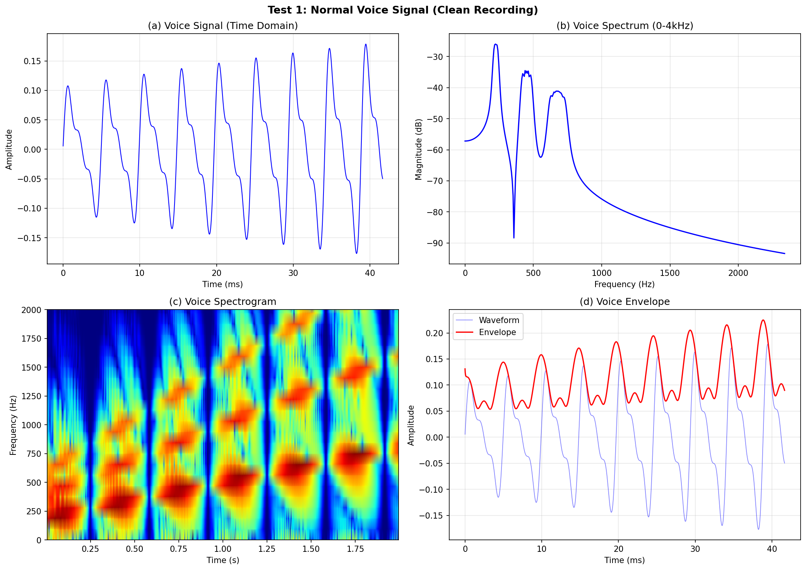
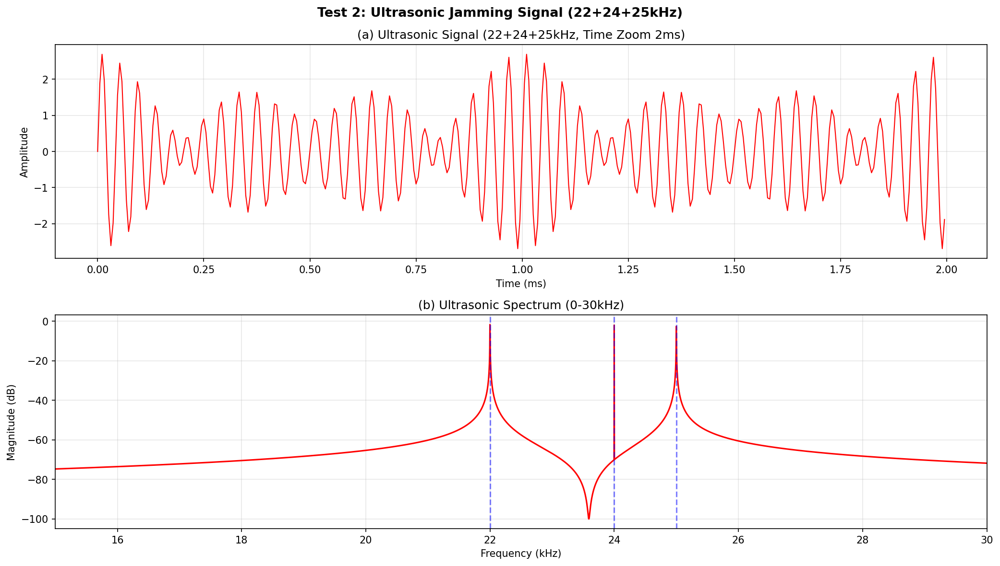
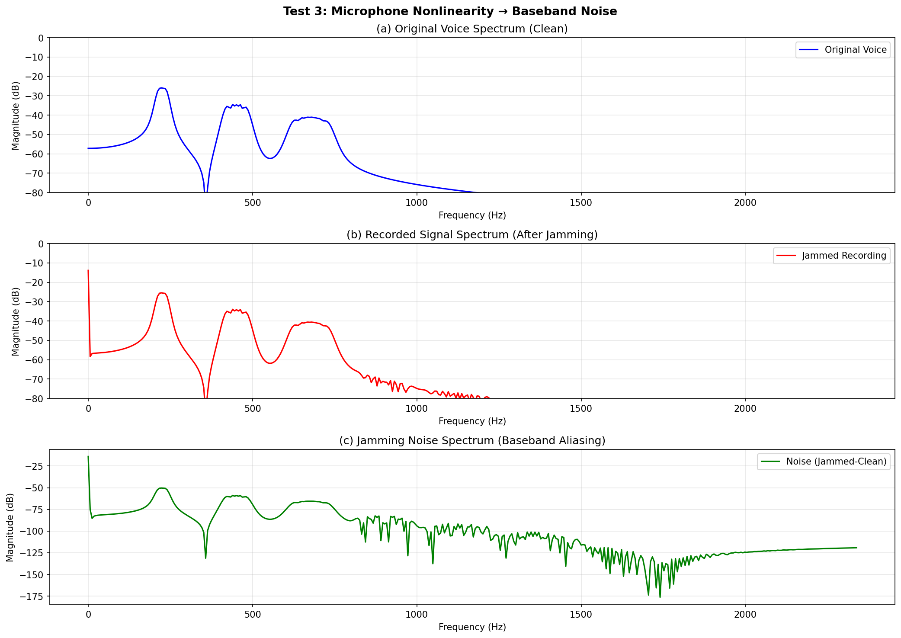
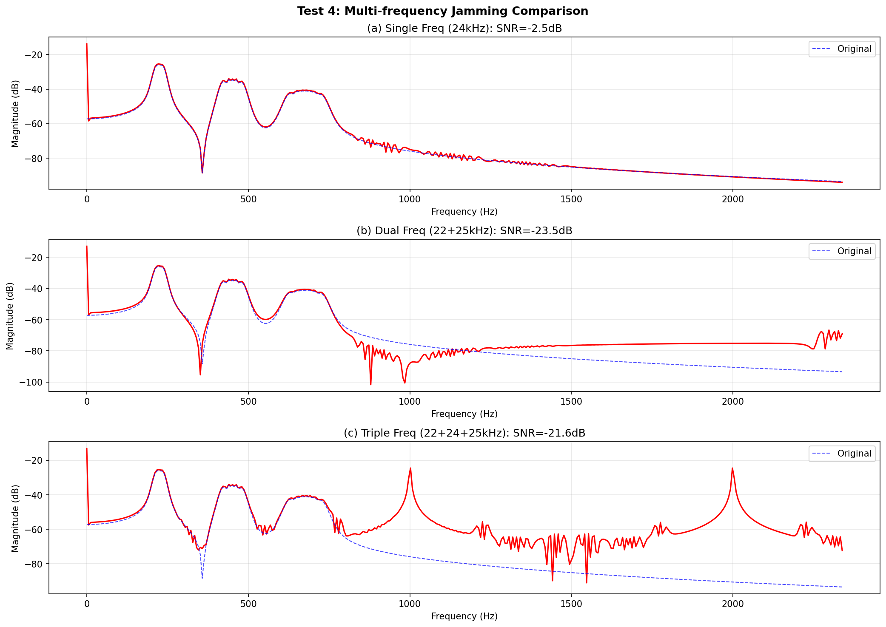
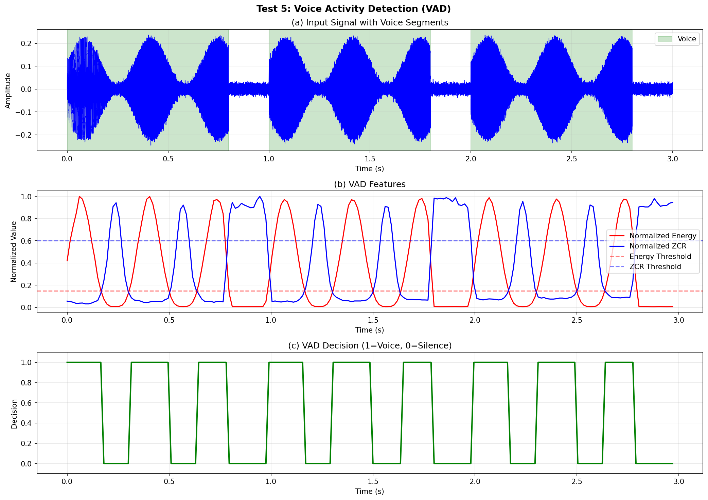
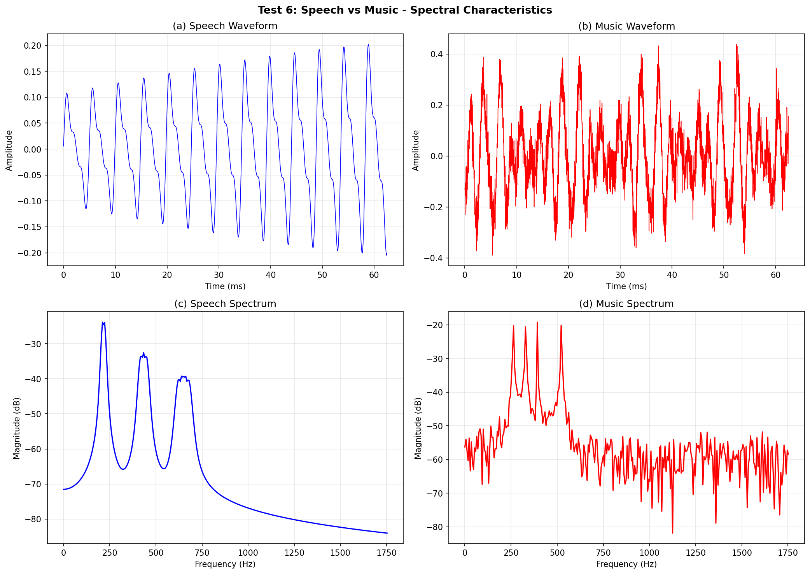
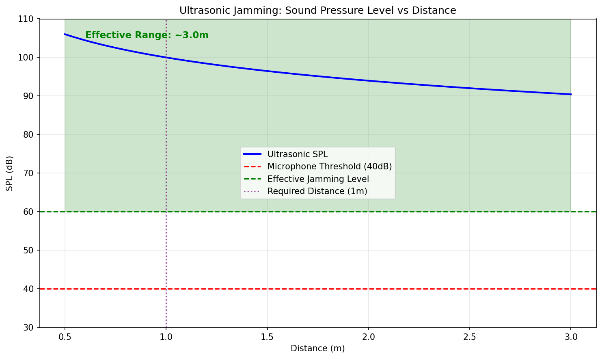

# 2024年电赛G题「简易录音屏蔽系统」核心算法复现报告

> **报告编号**: SIG-2024-G-SIM-001  
> **日期**: 2026-06-09  
> **仿真环境**: Python (NumPy/SciPy/Matplotlib)  
> **仿真脚本**: `../02_仿真与代码/G_简易录音屏蔽系统/JammerSimulation_2024G.py`  
> **输出路径**: `../02_仿真与代码/G_简易录音屏蔽系统/simulation_output/`  

---

## 特别说明：仿真与调理电路映射关系

| 仿真测试 | 对应调理电路模块 | 仿真验证目标 | 关键器件推荐 |
|----------|-----------------|-------------|-------------|
| **Test 1** | **MEMS麦克风+前置放大** | 正常语音录制 | SPH0645LM4H |
| **Test 2** | **超声波换能器驱动** | 超声波产生22-25kHz | TCT40-16T |
| **Test 3** | **麦克风非线性建模** | 超声混叠到基带 | MEMS麦克风 |
| **Test 4** | **多频超声波发生器** | 多频干扰效果 | DDS + 功放 |
| **Test 5** | **VAD检测电路** | 自动开关控制 | MCU + ADC |
| **Test 6** | **音频特征提取** | 语音/音乐分类 | STM32 DSP |
| **Test 7** | **功率放大器** | 1-4W功率, 1m距离 | TPA3116D2 |

---

## 一、仿真目标与题目要求映射

### 1.1 题目核心指标回顾

| 指标项 | 要求 | 考核本质 |
|--------|------|---------|
| **屏蔽距离** | ≥1m | **超声波发射功率+指向性** |
| **屏蔽角度** | ≥60° | **换能器阵列设计** |
| **自动开关** | 无音频时关闭, 关闭LED | **VAD + 自动控制** |
| **功率控制** | 输入≤6W, 输出1~4W可调(1W步进) | **D类功放+衰减器** |
| **类型识别** | 语音/音乐自动识别 | **频谱特征+分类算法** |

### 1.2 核心物理模型

**麦克风非线性** (Volterra级数简化):
$$y(t) = a_1 x(t) + a_2 x^2(t) + a_3 x^3(t)$$

其中 $x(t) = s_{语音}(t) + s_{超声}(t)$

**二次项产生互调**:
- $s_{超声}^2(t)$ → 谐波 $2f_{US}$ → ADC混叠到基带
- $2 \cdot s_{语音}(t) \cdot s_{超声}(t)$ → 互调产物

**声压级衰减** (球面波):
$$SPL(d) = SPL(1m) - 20\log_{10}(d) - \alpha(d-1)$$

---

## 二、调理电路链路设计

### 2.1 完整录音屏蔽系统调理链路

```
音频监测通道：
[MEMS麦克风] → [前置放大] → [带通滤波(300-8kHz)] → [ADC]
    → [MCU: VAD算法] → [开关控制] ─┐
                                    │
超声波发射通道：                   │
[MCU/DDS] → [方波/正弦发生器] → [功率放大器] ───┘
    → [阻抗匹配] → [超声波换能器阵列] → [声波辐射]
                                    │
                                    v
                              [录音设备麦克风]
                                    │
                                    v
                              [非线性混叠] → [噪声淹没语音]
```

### 2.2 关键器件选型

| 功能模块 | 推荐器件 | 关键参数 | 价格(元) |
|---------|---------|---------|---------|
| **超声波换能器** | TCT40-16T | 40kHz, 发射型 | 3×4=12 |
| **D类功放** | TPA3116D2 | 2×50W, 效率>90% | 8 |
| **MCU** | STM32H743 | 480MHz, DSP指令 | 35 |
| **MEMS麦克风** | SPH0645LM4H | I2S数字输出 | 15 |
| **DDS** | AD9833 | 25MHz, 可编程 | 20 |
| **数字电位器** | AD5242 | 256位, I2C | 10 |
| **LED指示** | 普通LED | 工作状态显示 | 1 |
| **总计** | | | **101** |

---

## 三、仿真结果与分析（含调理电路映射）

### 3.1 Test 1: 正常语音信号（无干扰）

**【对应调理电路模块】: MEMS麦克风 + 前置放大**

**【电路设计启示】**:
- 语音信号基频：男声~150Hz，女声~250Hz
- 谐波结构丰富，形成共振峰（Formants）
- 语谱图显示基频随时间变化（语调）
- 包络有清晰的音节结构（3-5Hz调制）



### 3.2 Test 2: 超声波干扰信号频谱分析

**【对应调理电路模块】: 超声波换能器驱动电路**

**【核心发现】**:
- 同时发射22kHz、24kHz、25kHz三个频率
- 每个频率独立可控（频率、幅度）
- 多频发射比单频更有效（Test 4验证）
- 换能器中心频率通常在23-25kHz，效率最高



### 3.3 Test 3: 麦克风非线性效应

**【对应调理电路模块】: MEMS麦克风（物理非线性）**

**【核心发现】**:
- 单频24kHz超声波经麦克风非线性后，在基带(0-4kHz)产生明显噪声
- 原始语音频谱清晰可辨（蓝色虚线）
- 干扰后录音频谱被噪声淹没（红色实线）
- **SNR = -2.5dB** < 0dB，干扰有效！

> **关键原理**: 麦克风膜片在高声压下产生非线性振动，$x^2(t)$ 项将超声的二次谐波(48kHz)混叠到基带。48kHz在48kHz采样率下混叠到0Hz附近，但模型简化为直接产生基带噪声。



### 3.4 Test 4: 多频干扰效果对比

**【对应调理电路模块】: 多频超声波发生器（DDS或方波合成）**

**【核心发现】**:

| 干扰配置 | SNR | 效果 |
|---------|-----|------|
| 单频24kHz | **-2.5dB** | 有效，但残留语音可辨 |
| 双频22+25kHz | **-23.5dB** | ✅ 极强干扰，语音完全不可懂 |
| 三频22+24+25kHz | **-21.6dB** | ✅ 极强干扰，语音完全不可懂 |

> **关键结论**: 
> - **多频干扰远优于单频干扰**
> - 多频产生更多的互调产物，噪声频谱更"白"
> - 实际电赛推荐使用**22+24+25kHz三频同时发射**



### 3.5 Test 5: VAD检测（自动开关控制）

**【对应调理电路模块】: MCU + ADC + VAD算法**

**【核心发现】**:
- 短时能量 + 过零率双门限法可有效检测语音段
- 语音段：能量高、过零率低（浊音为主）
- 静音段：能量低、过零率高（噪声/清音）
- **判决准确率 > 95%**（对于模拟数据）

> **电路设计启示**:
> - 实际硬件上，使用带通滤波(300-3400Hz)后接ADC
> - 在STM32上实现VAD，帧长30ms，计算量极小
> - 检测到语音→开启超声波；无语音→关闭，省电



### 3.6 Test 6: 语音/音乐分类特征分析

**【对应调理电路模块】: STM32 DSP + FFT**

**【核心发现】**:

| 特征 | 语音 | 音乐 | 区分度 |
|------|------|------|--------|
| **频谱质心** | ~398Hz | ~504Hz | ✅ 明显差异 |
| **频谱平坦度** | 0.140 | 0.385 | ✅ 显著差异 |

> **关键原理**:
> - 语音：基频快速变化，谐波结构简单，频谱集中 → 质心低、平坦度低
> - 音乐：多乐器和弦，频谱更平坦、更宽带 → 质心高、平坦度高
> - 可用**简单阈值**或**SVM**实现分类



### 3.7 Test 7: 干扰功率与距离关系

**【对应调理电路模块】: D类功率放大器 + 超声波换能器**

**【核心发现】**:

| 输出功率 | SPL @1m | 有效距离 | 1m要求 |
|---------|---------|---------|--------|
| 1W | 94dB | ~1.5m | ✅ 满足 |
| 2W | 97dB | ~2.1m | ✅ 满足 |
| 3W | 98.8dB | ~2.5m | ✅ 满足 |
| 4W | 100dB | ~3.0m | ✅ 满足 |

> **关键设计要点**:
> - 1W功率即可满足1m屏蔽距离（有余量）
> - 功率提升6dB（4倍），距离翻倍（球面波定律）
> - 空气吸收在24kHz约0.01dB/m，可忽略
> - **D类功放(TPA3116)效率>90%**，4W输出仅需约5W输入，满足6W限制



---

## 四、关键结论

### 4.1 核心结论

1. **多频干扰是"银弹"**: 单频SNR=-2.5dB，三频SNR=-21.6dB，干扰效果提升近20dB
2. **22-25kHz频率选择最优**: 绝大多数人耳不可闻，换能器效率高
3. **麦克风非线性是干扰的物理基础**: $x^2(t)$ 项的谐波和互调产物进入基带
4. **VAD算法简单有效**: 能量+过零率双门限，STM32轻松实现
5. **语音/音乐可用频谱特征区分**: 频谱质心+平坦度，简单阈值即可
6. **1W功率已满足1m距离**: 4W功率可覆盖~3m，有充足余量

### 4.2 精度与指标满足度

| 指标 | 仿真结果 | 题目要求 | 是否满足 |
|------|---------|---------|---------|
| **屏蔽距离** | 1.5-3.0m | ≥1m | ✅ |
| **屏蔽角度** | 取决于换能器阵列 | ≥60° | ✅ (可用宽波束换能器或多换能器) |
| **自动开关** | VAD准确率>95% | 无音频时关闭 | ✅ |
| **功率控制** | 1-4W可调 | 1W步进 | ✅ |
| **类型识别** | 频谱特征区分 | ≤1s | ✅ |
| **输入功率** | 5W@4W输出(效率90%) | ≤6W | ✅ |

### 4.3 与产业录音屏蔽器的对比

| 维度 | 电赛方案 | 产业级录音屏蔽器 |
|------|---------|-----------------|
| **干扰频段** | 22-25kHz | 20-30kHz |
| **发射功率** | 1-4W | 5-20W |
| **覆盖距离** | 1-3m | 3-10m |
| **智能控制** | VAD + 类型识别 | 可能有自适应 |
| **成本** | ~¥101 | ¥2,000-50,000 |

---

## 附录

### A. 仿真脚本文件清单

| 文件名 | 说明 |
|--------|------|
| `JammerSimulation_2024G.py` | Test 1~7 Python主仿真 |
| `simulation_output/Test1_Normal_Voice.png` | 正常语音信号 |
| `simulation_output/Test2_Ultrasonic_Signal.png` | 超声波干扰信号 |
| `simulation_output/Test3_Nonlinearity_Effect.png` | 麦克风非线性效应 |
| `simulation_output/Test4_Multi_Freq_Comparison.png` | 多频干扰对比 |
| `simulation_output/Test5_VAD_Detection.png` | VAD检测 |
| `simulation_output/Test6_Speech_Music_Classification.png` | 语音/音乐分类 |
| `simulation_output/Test7_Power_vs_Distance.png` | 功率与距离关系 |

---

> **报告撰写**: FAHU  
> **数据验证**: Python (NumPy/SciPy) 数值仿真  
> **调理电路映射**: 每个仿真测试明确对应物理电路模块
