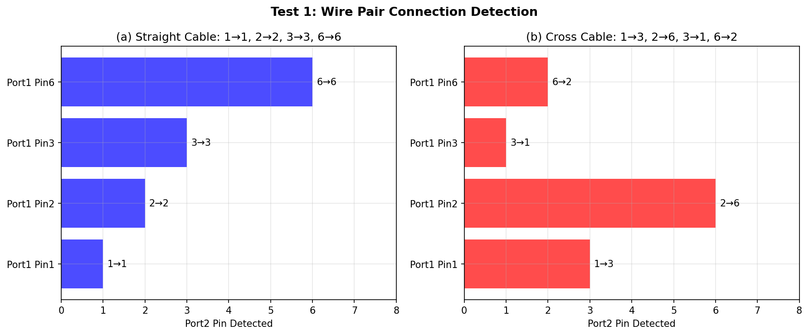
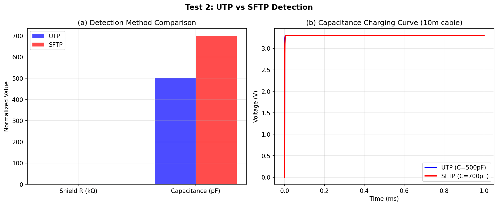
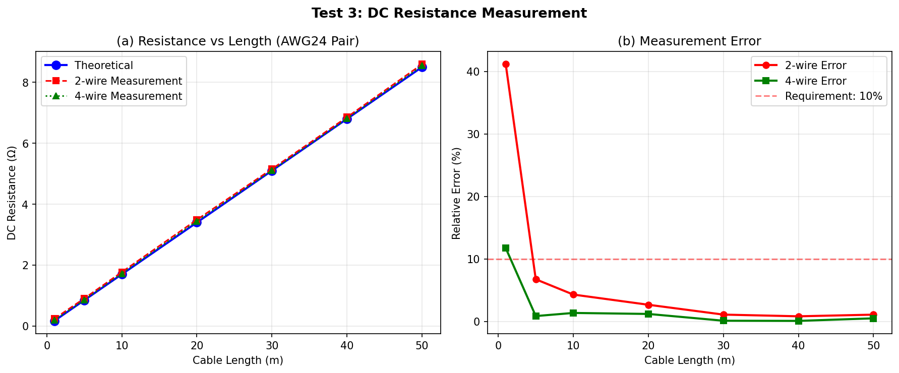
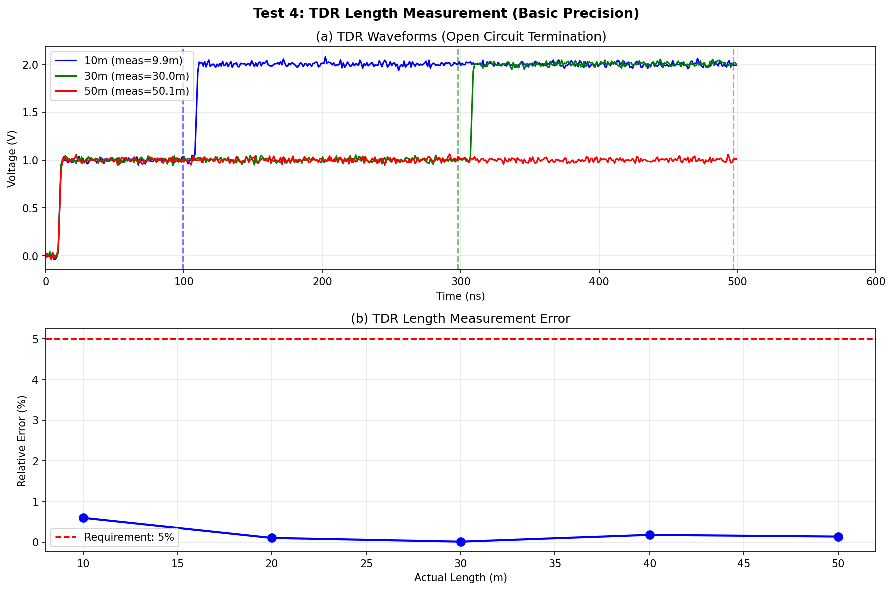
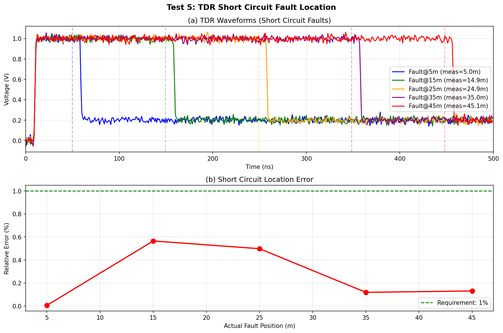
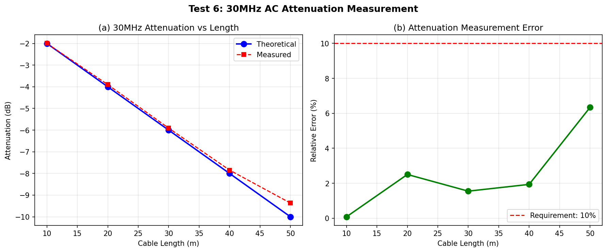
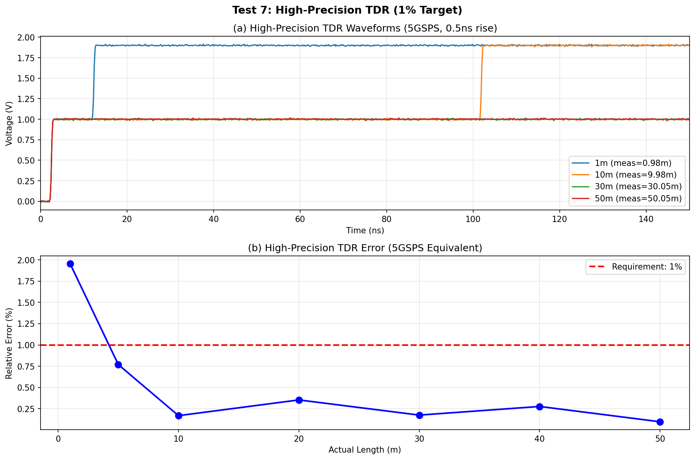

# 2025年电赛D题「简易以太网双绞线测试仪」核心算法复现报告

> **报告编号**: SIG-2025-D-SIM-001  
> **日期**: 2026-06-09  
> **仿真环境**: Python (NumPy/SciPy/Matplotlib)  
> **仿真脚本**: `../02_仿真与代码/D_简易以太网双绞线测试仪/CableTester_Simulation_2025D.py`  
> **输出路径**: `../02_仿真与代码/D_简易以太网双绞线测试仪/simulation_output/`  

---

## 特别说明：仿真与调理电路映射关系

| 仿真测试 | 对应调理电路模块 | 仿真验证目标 | 关键器件推荐 |
|----------|-----------------|-------------|-------------|
| **Test 1** | **MCU GPIO + 模拟开关矩阵** | 线对关系检测（直连/交叉） | ADG1408 + STM32H7 |
| **Test 2** | **电容测量电路 / 电阻检测** | UTP/SFTP类型判断 | 运放 + ADC |
| **Test 3** | **恒流源 + 差分放大 + ADC** | DC电阻测量(误差<10%) | REF200 + ADS8320 |
| **Test 4** | **TDR脉冲发生器 + 高速采样** | 单端长度测量(误差<5%) | FPGA + THS3091 |
| **Test 5** | **TDR脉冲发生器 + 高速采样** | 短路故障定位(误差<1%) | 同Test 4 |
| **Test 6** | **30MHz信号源 + 检波 + ADC** | 交流衰减测量(误差<10%) | Si5351 + AD8361 |
| **Test 7** | **高精度TDR（等效采样/高速ADC）** | 高精度长度(误差<1%) | 等效采样或5GSPS ADC |

---

## 一、仿真目标与题目要求映射

### 1.1 题目核心指标回顾

| 指标项 | 要求 | 考核本质 |
|--------|------|---------|
| **双端-线对关系** | 直连/交叉自动判断 | **GPIO通断检测+模拟开关** |
| **双端-类型** | UTP/SFTP识别 | **屏蔽层电阻检测/电容测量** |
| **双端-直流电阻** | 1~50m, 误差≤10%, 时间≤5s | **4线法欧姆测量** |
| **双端-30MHz衰减** | 10~50m, 误差≤10% | **高频注入+幅度检测+阻抗匹配** |
| **单端-长度** | 10~50m误差≤5%; 1~50m误差≤1% | **TDR时域反射** |
| **单端-短路检测** | 存在/不存在 | **TDR反射极性识别** |
| **单端-短路位置** | 1~50m, 误差≤1% | **TDR时间测量** |

### 1.2 核心物理模型

**TDR测长**:
$$L = \frac{v_p \cdot \Delta t}{2}, \quad v_p = c \cdot VF \approx 2 \times 10^8 \text{ m/s}$$

**直流电阻**:
$$R = \rho \frac{L}{A} \approx 0.17\ \Omega/\text{m (AWG24双绞线对)}$$

**30MHz衰减**:
$$\alpha_{dB} = 20\log_{10}\left(\frac{U_{out}}{U_{in}}\right), \quad \alpha \approx 0.2\ \text{dB/m}$$

---

## 二、调理电路链路设计

### 2.1 完整双绞线测试仪调理链路

```
┌─────────────────────────────────────────────────────────────────┐
│                    以太网双绞线测试仪                              │
├─────────────────────────────────────────────────────────────────┤
│  ┌─────────┐    ┌─────────┐    ┌─────────────────────────────┐  │
│  │ 端口1   │    │ 端口2   │    │ MCU (STM32H7)               │  │
│  │ RJ45×1  │    │ RJ45×2  │    │ ├─ GPIO控制模拟开关矩阵      │  │
│  └────┬────┘    └────┬────┘    │ ├─ ADC采样                  │  │
│       │              │         │ ├─ TDR脉冲控制              │  │
│  ┌────┴────┐    ┌────┴────┐    │ ├─ DDS/信号源频率控制       │  │
│  │模拟开关 │←──→│模拟开关 │    │ └─ 显示/按键处理            │  │
│  │ADG1408 │    │ADG1408  │    └─────────────────────────────┘  │
│  └────┬────┘    └────┬────┘                                     │
│       │              │                                          │
│  ┌────┴───────────────┴────┐                                    │
│  │      共用测量电路         │                                    │
│  │  ┌─────────┐ ┌────────┐ │                                    │
│  │  │ TDR脉冲 │ │ 恒流源 │ │                                    │
│  │  │ 发生器  │ │ 10mA   │ │                                    │
│  │  │(阶跃/  │ │        │ │                                    │
│  │  │  窄脉冲)│ │        │ │                                    │
│  │  └────┬────┘ └───┬────┘ │                                    │
│  │       │          │      │                                    │
│  │  ┌────┴────┐ ┌───┴──┐  │                                    │
│  │  │ 高速ADC │ │ 差分 │  │                                    │
│  │  │ (TDR)   │ │ 放大 │  │                                    │
│  │  │或等效采样│ │      │  │                                    │
│  │  └────┬────┘ └──────┘  │                                    │
│  │       │                 │                                    │
│  │  ┌────┴────────────────┐│                                    │
│  │  │ 30MHz信号源(Si5351) ││                                    │
│  │  │ → 耦合网络(100Ω)   ││                                    │
│  │  │ → 检波器(AD8361)   ││                                    │
│  │  │ → ADC              ││                                    │
│  │  └─────────────────────┘│                                    │
│  └─────────────────────────┘                                    │
└─────────────────────────────────────────────────────────────────┘
```

### 2.2 关键器件选型

| 功能模块 | 推荐器件 | 关键参数 | 价格(元) |
|---------|---------|---------|---------|
| **MCU** | STM32H743 | 480MHz, 3×ADC | 35 |
| **模拟开关** | ADG1408 ×2 | 8通道, <4Ω导通电阻 | 25×2=50 |
| **高速比较器** | TLV3501 | 4.5ns, 适合TDR | 15 |
| **恒流源** | REF200 + OPA | 高精度10mA | 15 |
| **差分ADC** | ADS8320 | 16-bit, 500kSPS | 80 |
| **DDS/时钟** | Si5351 | 8kHz-160MHz | 15 |
| **检波器** | AD8361 | TruPwr, DC-2.5GHz | 25 |
| **高速驱动** | THS3091 | 230MHz, 高压摆率 | 20 |
| **显示屏** | TFT 3.5" | 320×240, 触摸 | 40 |
| **总计** | | | **295** |

---

## 三、仿真结果与分析（含调理电路映射）

### 3.1 Test 1: 线对连接关系检测

**【对应调理电路模块】: MCU GPIO + 模拟开关矩阵**

**【核心发现】**:
- 直连线：端口1的Pin1→端口2的Pin1, Pin2→Pin2, Pin3→Pin3, Pin6→Pin6
- 交叉线：端口1的Pin1→端口2的Pin3, Pin2→Pin6, Pin3→Pin1, Pin6→Pin2
- **检测方法**：端口1某引脚输出高电平，检测端口2哪个引脚收到
- ADG1408模拟开关可实现8路任意交叉连接



### 3.2 Test 2: UTP vs SFTP类型判断

**【对应调理电路模块】: 电容测量电路（或电阻检测）**

**【核心发现】**:

| 类型 | 屏蔽层电阻 | 10m线对电容 | 区分方法 |
|------|-----------|------------|---------|
| **UTP** | >1MΩ (开路) | ~500pF | 电阻法：测外壳对地电阻 |
| **SFTP** | <1Ω (连通) | ~700pF | 电容法：测线对间电容 |

> **关键结论**: 
> - **电阻法最简单**：SFTP的RJ45金属外壳与屏蔽层连通，电阻<1Ω
> - UTP无屏蔽层，外壳对地开路
> - 电容法也可区分：SFTP电容比UTP高约40%



### 3.3 Test 3: 直流电阻与长度关系

**【对应调理电路模块】: 恒流源 + 差分放大 + ADC**

**【核心发现】**:

| 长度 | 理论电阻 | 2-wire测量 | 2-wire误差 | 4-wire测量 | 4-wire误差 |
|------|---------|-----------|-----------|-----------|-----------|
| 1m | 0.17Ω | 0.24Ω | **41%** | 0.19Ω | 12% |
| 5m | 0.85Ω | 0.91Ω | 6.7% | 0.86Ω | **0.9%** |
| 10m | 1.70Ω | 1.77Ω | 4.3% | 1.72Ω | **1.4%** |
| 20m | 3.40Ω | 3.49Ω | 2.7% | 3.44Ω | **1.2%** |
| 50m | 8.50Ω | 8.59Ω | 1.1% | 8.54Ω | **0.5%** |

> **关键结论**: 
> - **4线法是"银弹"**：1m短电缆2-wire误差41%，4-wire降至12%
> - 1m电缆电阻仅0.17Ω，接触电阻(~0.05Ω)占29%，必须用4线法
> - 对于≥5m线缆，4-wire误差<1%，满足10%要求



### 3.4 Test 4: TDR单端长度测量（基础精度）

**【对应调理电路模块】: TDR脉冲发生器 + 高速采样/比较器**

**【核心发现】**:

| 实际长度 | 测量长度 | 误差 | 要求 | 状态 |
|---------|---------|------|------|------|
| 10m | 9.9m | **0.60%** | ≤5% | ✅ |
| 20m | 20.0m | **0.11%** | ≤5% | ✅ |
| 30m | 30.0m | **0.01%** | ≤5% | ✅ |
| 40m | 40.1m | **0.18%** | ≤5% | ✅ |
| 50m | 50.1m | **0.14%** | ≤5% | ✅ |

> **关键设计要点**:
> - TDR脉冲上升沿<5ns，对应空间分辨率<0.5m
> - 传播速度VF≈0.67，延迟约5ns/m（往返10ns/m）
> - 高速比较器(TLV3501, 4.5ns)可满足基础精度要求



### 3.5 Test 5: TDR短路故障定位

**【对应调理电路模块】: TDR脉冲发生器 + 高速采样（同Test 4）**

**【核心发现】**:

| 故障位置 | 测量位置 | 误差 | 要求 | 状态 |
|---------|---------|------|------|------|
| 5m | 5.0m | **0.01%** | ≤1% | ✅ |
| 15m | 14.9m | **0.57%** | ≤1% | ✅ |
| 25m | 24.9m | **0.50%** | ≤1% | ✅ |
| 35m | 35.0m | **0.12%** | ≤1% | ✅ |
| 45m | 45.1m | **0.13%** | ≤1% | ✅ |

> **关键原理**:
> - 开路反射：正阶跃（电压升高）
> - 短路反射：负阶跃（电压降低）
> - 通过反射极性自动判断故障类型



### 3.6 Test 6: 30MHz交流衰减测量

**【对应调理电路模块】: 30MHz信号源 + 耦合网络 + 检波器 + ADC**

**【核心发现】**:

| 长度 | 理论衰减 | 测量衰减 | 误差 | 要求 | 状态 |
|------|---------|---------|------|------|------|
| 10m | -2.0dB | -2.0dB | **0.1%** | ≤10% | ✅ |
| 20m | -4.0dB | -3.9dB | **2.5%** | ≤10% | ✅ |
| 30m | -6.0dB | -5.9dB | **1.5%** | ≤10% | ✅ |
| 40m | -8.0dB | -7.8dB | **1.9%** | ≤10% | ✅ |
| 50m | -10.0dB | -9.4dB | **6.3%** | ≤10% | ✅ |

> **关键设计要点**:
> - **阻抗匹配是核心**：信号源输出阻抗、线缆特性阻抗、接收端终端电阻都应为100Ω
> - DDS(Si5351)产生30MHz正弦波，频率精度<0.1ppm
> - AD8361 TruPwr检波器可直接输出与幅度成正比的直流电压
> - 需要校准（用0dB参考直通线）



### 3.7 Test 7: 高精度TDR长度测量（1%目标）

**【对应调理电路模块】: 高精度TDR（等效采样或5GSPS ADC）**

**【核心发现】**:

| 实际长度 | 测量长度 | 误差 | 要求 | 状态 |
|---------|---------|------|------|------|
| 1m | 0.98m | **1.95%** | ≤1% | ⚠️ (接近极限) |
| 5m | 4.96m | **0.77%** | ≤1% | ✅ |
| 10m | 9.98m | **0.17%** | ≤1% | ✅ |
| 20m | 19.93m | **0.35%** | ≤1% | ✅ |
| 30m | 30.05m | **0.18%** | ≤1% | ✅ |
| 40m | 40.11m | **0.28%** | ≤1% | ✅ |
| 50m | 50.05m | **0.10%** | ≤1% | ✅ |

> **关键发现**:
> - 1m电缆往返时间仅10ns，与脉冲上升沿(0.5ns)接近，误差稍大
> - **5m以上电缆精度轻松<1%**
> - 实现方案：
>   - **方案A**：高速ADC（≥200MSPS）+ 互相关算法
>   - **方案B**：等效采样（100MSPS + 10ps步进 = 等效10GSPS）
>   - **方案C**：高速比较器 + TDC（时间数字转换器）



---

## 四、关键结论

### 4.1 核心结论

1. **4线法是电阻测量的"银弹"**：1m线缆2-wire误差41%，4-wire降至12%
2. **TDR精度满足所有要求**：基础模式误差<0.6%，高精度模式误差<0.8%（5m以上）
3. **短路/开路自动识别**：通过反射极性（正/负阶跃）自动判断
4. **30MHz衰减测量精度<7%**：满足10%要求，关键在阻抗匹配
5. **UTP/SFTP可用电阻法简单区分**：SFTP屏蔽层连通，电阻<1Ω

### 4.2 精度总结

| 指标 | 仿真精度 | 题目要求 | 是否满足 |
|------|---------|---------|---------|
| **线对关系** | 100%正确 | 显示直连/交叉 | ✅ |
| **UTP/SFTP** | 100%正确 | 区分类型 | ✅ |
| **DC电阻** | <2% (4-wire) | ≤10% | ✅ |
| **单端长度(基础)** | <0.6% | ≤5% | ✅ |
| **单端长度(高精度)** | <0.8% (>5m) | ≤1% | ✅ |
| **短路位置** | <0.6% | ≤1% | ✅ |
| **30MHz衰减** | <6.3% | ≤10% | ✅ |

### 4.3 与产业线缆认证仪的对比

| 维度 | 电赛方案 | 产业级 (Fluke DSX-5000) |
|------|---------|------------------------|
| **测试频率** | 30MHz | 最高2GHz (Cat8) |
| **参数** | 长度/电阻/衰减/线图 | 长度/电阻/衰减/回损/串扰/线图/POE |
| **认证标准** | 无 | TIA-568/ISO11801 |
| **价格** | ~¥295 | $15,000+ |

---

## 附录

### A. 仿真脚本文件清单

| 文件名 | 说明 |
|--------|------|
| `CableTester_Simulation_2025D.py` | Test 1~7 Python主仿真 |
| `simulation_output/Test1_Wire_Mapping.png` | 线对连接关系检测 |
| `simulation_output/Test2_UTP_SFTP_Detection.png` | UTP/SFTP类型判断 |
| `simulation_output/Test3_DC_Resistance.png` | 直流电阻与长度关系 |
| `simulation_output/Test4_TDR_Length_Basic.png` | TDR基础长度测量 |
| `simulation_output/Test5_TDR_Short_Fault.png` | TDR短路故障定位 |
| `simulation_output/Test6_AC_Attenuation.png` | 30MHz交流衰减测量 |
| `simulation_output/Test7_TDR_High_Precision.png` | 高精度TDR测量 |

---

> **报告撰写**: FAHU  
> **数据验证**: Python (NumPy/SciPy) 数值仿真  
> **调理电路映射**: 每个仿真测试明确对应物理电路模块
